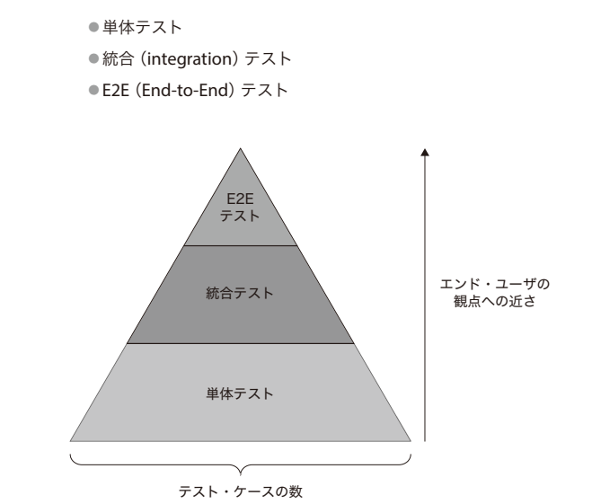
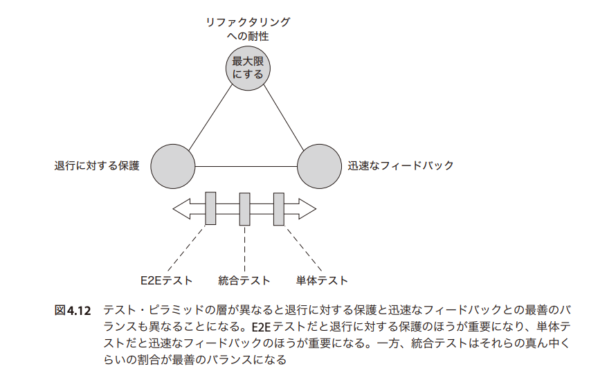

# フロントエンドの(単体)テスト
<!-- - Jest を使ったテストの書き方 -->
<!--   - toEqual: 再帰的に中身を見て等価なのかを比較 -->
<!--   - toBe: オブジェクトとして等価なのかを比較 -->
- テストの種類
- 具体的なテストの書き方
- Vitest と Jest の違い
- nuxt でのテスト

# テストの種類
テストピラミッド

上に行くほどテストのコストがかかる。
単体テストがコストが低い

## 良い単体テストを構成する4本の柱
- 退行 regression に対する保護(いわゆるデグレしてないかのチェック)
- リファクタリングへの耐性
  - 偽陽性を排除するためテスト・コードをテスト対象の内部的なコードから切り離すこと
  - 偽陽性: 機能自体には何も問題がないのにもかかわらず、テストが失敗すること
- 迅速なフィードバック
- 保守のしやすさ

### 偽陽性の問題点
- プロダクション・コードに潜む問題を解決しようとする開発者の能力と意思を弱めてしまう。なぜなら、開発者は嘘の警告（テストの間違った失敗）に慣れてしまい、その警告に注意を払わなくなってしまうからである。
- テストを信頼できるセーフティ・ネットとして見ることができなくなり、そのテストへの信頼が失われることになる。

### どのようなテストを作るべきか
- 保守のしやすさ以外はトレードオフな柱である。すべてを備えたテストは実現できない
- リファクタリングへの耐性を最大限にしつつ、退行に対する保護と迅速なフィードバックのバランスを取る戦略を取るのが良い
  - リファクタリングへの耐性を重要視する理由はテストの壊れやすさ(偽陽性)を取り除くことで、リファクタリングをしやすくしたいから。

# 具体的なテストの書き方
実装の詳細に踏み込んでテストすると保守性が下がりやすい。
外部から見たふるまいをテストすべき。
具体例を以下に記述する。

ホワイトボックステスト
- how ではなく what に注目するテスト

ブラックボックステスト
- how と what に注目するテスト

リファクタリングへの耐性を考えると、ブラックボックステストを選択すべき

ただし、コードの分析としてホワイトボックステストは使える。たとえば、実装中のコードに関して how を確認する手段としてホワイトボックステストを作り、最終的にはブラックボックステストにする等の流れでテストを作成すると良い。
また、複雑な実装をそのままにしてホワイトボックステストを残すという選択もありではある。その際は、リファクタリングへの耐性をトレードオフにして、退行に対する保護を優先しているという意識を持ってやるべき。

https://github.com/yorisilo/frontend-sandbox/tree/main/packages/testing/

# vitest と jest の違い
- vitest: vite と jest 組み合わせてみました的なやつ

# nuxt でのテスト
nuxt で test しようとするとめちゃくちゃつらい。
- vitest 環境と nuxt 環境は別物なので、 vitest 上で nuxt を模倣する必要がある
- auto import がつらい ~~-> やめましょう。マジでいらない。何を読み込んでるのかが分かりづらいし、テストもうまくできない~~
- vue3 系の ref とかの関数の auto import は解決する方法はある。しかし nuxt の useState とかを含む Composables や component をテストしようとすると本当につらい。
- ひとまずの解決方法は、
  - auto import をやめる。 useState は auto import をやめたとて、テスト時に useState が動かないので、 mock 化して使う。
  - unplugin-auto-import/vite を使って vue の ref とかは auto import に対応できる。 しかし、 Nuxt3 の useState 等には対応してないので、 mock 化して使う

cf.
- おすすめ [Nuxt 3 × Vitest でユニットテストのエラーを全て解消するための調査レポート \- ANDPAD Tech Blog](https://tech.andpad.co.jp/entry/2023/03/16/100000)
- [Set up Nuxt3 with Jest & TypeScript \| by Florian Gößler \| Medium](https://medium.com/@fgoessler/set-up-nuxt3-with-jest-typescript-80aa4d3cfabc)
- [Nuxt 3 × Vitest で単体テストの実行環境を作る](https://zenn.dev/ytr0903/articles/8f4e3c0e529c6f)
- [support for unit testing in a nuxt environment · Issue \#13077 · nuxt/nuxt](https://github.com/nuxt/nuxt/issues/13077)
- https://twitter.com/mmyoji/status/1626558136915197953?s=20
- https://twitter.com/tomo_sakurai114/status/1548556486732759040?s=20

# 参考
- おすすめ書籍 [単体テストの考え方/使い方 プロジェクトの持続可能な成長を実現するための戦略【委託】 \- 達人出版会](https://tatsu-zine.com/books/unit-testing-principles-practices-and-patterns)
- テスト方法: Example Based Testing < Property Based Testing < 証明
  - [fast\-check で Property Based Testing を試してみる](https://zenn.dev/ryo_kawamata/articles/22d4408bd1f138)
