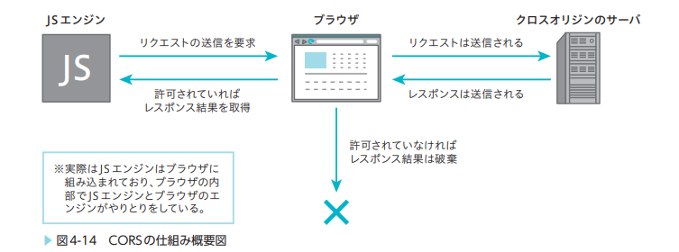
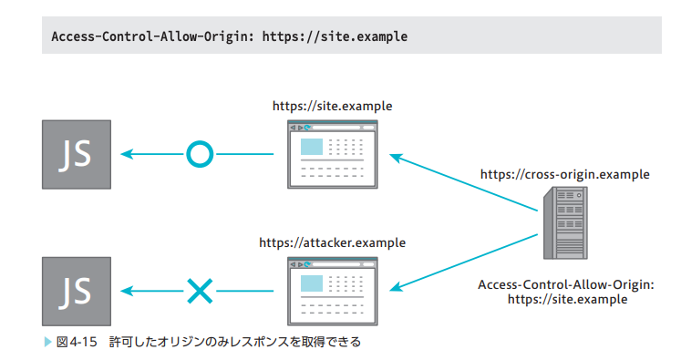
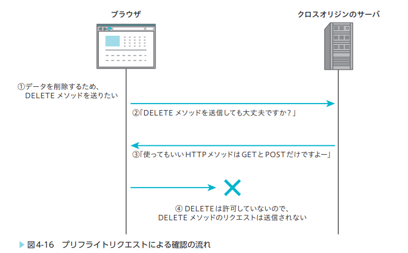
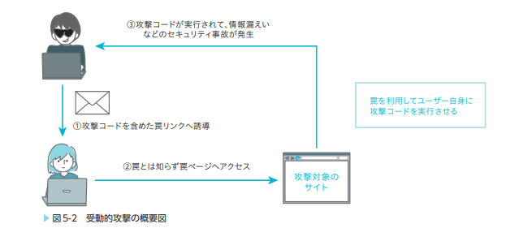
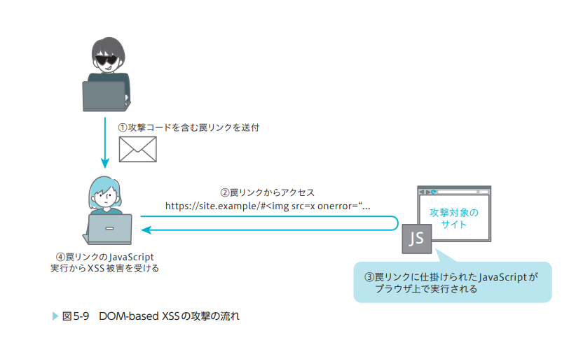
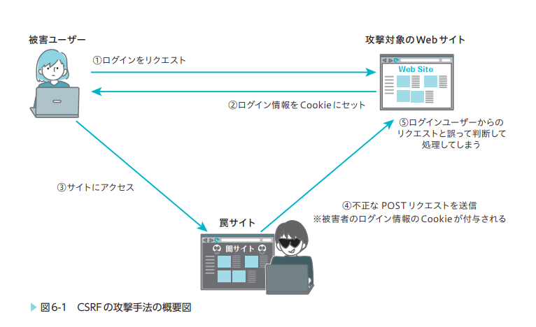
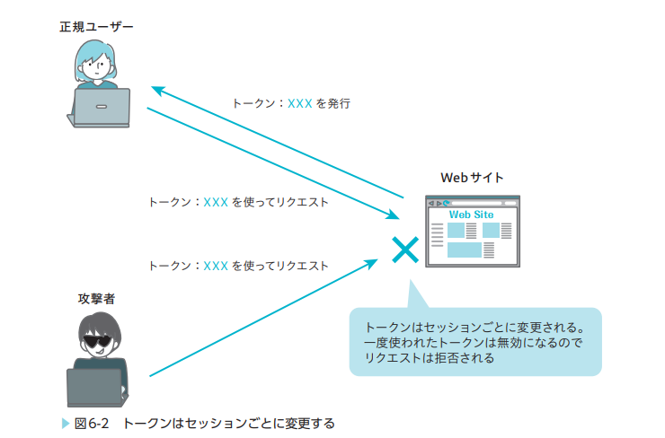

# フロントエンドのセキュリティ
OWASP

# 一般的なセキュリティ
- オリジン
  - CORS
- XSS
  - サニタイズ処理による対策
- CSRF
- Vue, Nuxt でのセキュリティ

# HTTPS

# オリジン
ex. `https://example.com:443/path/to/index.html`
- `https://example.com:443` がオリジン

web アプリケーションのオリジンが同じことを同一オリジン(Same-Origin)、異なることをクロスオリジン(Cross-Origin)と呼ぶ

## 同一オリジンポリシー
- 同一オリジンにのみリソースアクセスを許可する
- ブラウザはデフォルトで同一オリジンポリシーを有効にしている

アクセス制限されていることの例
- JavaScriptを使ったクロスオリジンへのリクエストの送信
- JavaScriptを使ったiframe内のクロスオリジンのページへのアクセス
- クロスオリジンの画像を読み込んだ `<canvas>` 要素のデータへのアクセス
- Web StorageやIndexedDBに保存されたクロスオリジンのデータへのアクセス
  - 異なるオリジンで web storage(session, local storage) を共有したい場合は、window.postMessage などを使う必要がある。

## CORS(Cross-Origin Resource Sharing)
- クロスオリジンへのリソースアクセスを許可するしくみを記載した仕様
この仕様に合わせて、 web ブラウザや web サーバーは実装することを期待している。
サーバーからリクエスト元の Origin に対して CORSヘッダ(俗称)が設定されていれば、ブラウザ上でリソースにアクセスできる。



> XMLやfetch関数を使ってクロスオリジンへリクエストを送信することは同一オリジンポリシーによって禁止されています。具体的には、クロスオリジンから受信したレスポンスのリソースへのアクセスが禁止されています。

### simple request
Fetch Standard と呼ばれる仕様の中で、 CORS の仕様も定義されており、 CORS-safelisted な HTTP メソッド、 HTTP ヘッダのリクエストが simple request と呼ばれる。
> 具体的には、 ``要素や `<link>` 要素など、リソースを取得するGETによるリクエストや、`<form>` 要素を使ったGETまたはPOSTによるブラウザがデフォルトで送信できるリクエスト

- CORS-safelisted な HTTP メソッド
  - GET
  - HEAD
  - POST
- CORS-safelisted な HTTP ヘッダ
  - Accept
  - Accept-Language
  - Content-Language
  - Content-Type
    - 値が application/x-www-form-urlencoded、multipart/form-data、text/plain のいずれか

- Access-Control-Allow-Origin ヘッダ: 注意することとして、実際にサーバー側では処理されて、レスポンス自体はブラウザへ返却されているということ。(レスポンス自体はネットワークキャプチャ等をすればみることはできる)あくまでも、 JavaScript を使ったアクセスができるかどうかを禁止するのが Access-Control-Allow-Origin の役目である。


simple request の条件を満たさないものは、 preflight request を行ってからリクエストを行う

### preflight request
- preflight request: ほんちゃんのリクエストを送る前に本当にこのリクエストを送ってもいいかを事前に問い合わせるリクエストのこと

サーバー上の Web API で Access-Control-Allow-Origin で許可されてない Origin に対して、リクエストが来たとしてもサーバーはその Origin からのリクエストを防ぐことはできない。  Access-Control-Allow-Origin はあくまでも、レスポンスの内容へのアクセス許可を ブラウザ(JavaScript) に許可するものであって、サーバーへの処理をやめるということではない。
この対策として、 preflight request は存在する。



### cookie を含むリクエストの送信
> ページの遷移時やフォームの送信といったリクエストが行われた際は、ブラウザはCookieを自動的にサーバへ送信する。が、
> しかし、JavaScriptを使ったクロスオリジンの通信では、Cookieは送信されません。

例えば fetch 関数は cookie を送信するための設定として、 `credentials` option が用意されている。

``` typescript
fetch("https://cross-origin.example/cors", {
 method: "GET",
 credentials: "include",
});
```

- credentials
  - omit: Cookie を送信しない。 credentials を設定しない場合のデフォルト値
  - same-origin: 同一オリジンのみ Cookie を送信する
  - include: オリジンに関係なく、常に Cookie を送信する

Cookie 付きのリクエストをクロスオリジンへ送るためには、サーバー側でも CORS の設定が必要

- 以下のように Access-Control-Allow-Credentials を true にする必要があり、 Access-Control-Allow-Origin に何らかのオリジンを記載する必要がある。
- Access-Control-Allow-Credentials を true にしたら、 Access-Control-Allow-Origin の `*` は無効化される。

> `*` が指定できてしまうと、すべてのオリジンに対してCookieを送信することになって危険なため、開発者が*を指定したとしてもCookieを送信しないようにブラウザが制限しています。

``` http
HTTP/1.1 200 OK
Access-Control-Allow-Origin: https://cross-origin.example
Access-Control-Allow-Credentials: true
```

# 受動的攻撃
攻撃者は直接攻撃をせず、ユーザーによって間接的に攻撃する手法のこと



- XSS（クロスサイトスクリプティング）
- CSRF（クロスサイトリクエストフォージェリ）
- クリックジャッキング
- オープンリダイレクト
など

# XSS (Cross-site scripting)
- Web アプリケーション内の脆弱性を利用して不正なスクリプトを実行する攻撃
- XSS はユーザーが入力した文字列をそのまま HTML へ挿入することで発生する脆弱性

## 具体的な XSS
- 反射型 XSS (Reflected XSS)
- 蓄積型 XSS (Stored XSS)
- DOM-based XSS <- フロントエンドのコードの不備によって発生する

## DOM-based XSS
> JavaScript による DOM 操作が原因で発生する XSS



### 対策
- ユーザーからの入力をそのまま使わないのが基本的に鉄則
- ユーザーから入力された HTML や文字列を直接反映させない

### vue ではどうするか
- innerHTML のような v-html というディレクティブがあるので、それを使う場合は信頼しているコンテンツだけ使う
- マスタッシュ記法やサニタイズ処理、バリデーション等を使って入力値をそのまま出さないようにする
cf. [セキュリティー \| Vue\.js](https://ja.vuejs.org/guide/best-practices/security.html)

# CSRF or XSRF (Cross-Site Request Forgeries)
- Web アプリケーションがもともと持っている機能がユーザーの意思に関係なく呼び出されてしまう攻撃
- 基本的にはサーバー側での対策が必要な脆弱性
> CSRFは、XSSのように攻撃者が自由にスクリプトを動かしたり、Webアプリケーションにリクエストを発行したりといったことはできませんが、送金処理やアカウント削除、SNSへの投稿など、そのWebアプリケーションが本来持っている機能に対して、不正にリクエストを送信させることが可能です。
> 過去にはTwitterやmixiといったSNSでも、CSRFによってユーザーが意図していない悪意のある投稿が行われた事例があります。この節ではCSRFの仕組みと対策について説明します。



### 対策
- CSRF 対策で最も重要なことは、罠サイトから送信されたリクエストなのか、想定の Web アプリケーションから送信された正規のリクエストなのかをサーバ内で検証すること
トークンを利用したCSRF対策だったり、 Cookie を使う対策がある。


# vue, nuxt でのセキュリティ
- [セキュリティー \| Vue\.js](https://ja.vuejs.org/guide/best-practices/security.html)
- [Nuxt3入門\(第5回\) \- アプリケーションの設定情報を管理する \| 豆蔵デベロッパーサイト](https://developer.mamezou-tech.com/nuxt/nuxt3-app-configuration/)
- [Nuxt3入門\(第6回\) \- アプリケーションで発生するエラーに対応する \| 豆蔵デベロッパーサイト](https://developer.mamezou-tech.com/nuxt/nuxt3-error-handling/)

## SSR の場合、状態が他の人と共有されてしまう可能性があるので注意
ref をグローバルスコープで使い、状態を共有してしまうと他のユーザーの状態を参照できてしまう可能性がある。
このような実装ミスによる問題を回避するためには、ref や useState を setup 内で使用することで、各ユーザーに対して独立した状態を持たせることが重要

# まとめ
- 脆弱性への対策は基本的にこれをやったら絶対大丈夫みたいな銀の弾丸はない。
- 日頃フレームワークに守られているからと言って対策をおろそかにしてはいけない。

# 参考
- [フロントエンドのセキュリティについて調べてみた \| iret\.media](https://iret.media/59252)
- おすすめ書籍 [フロントエンド開発のためのセキュリティ入門 知らなかったでは済まされない脆弱性対策の必須知識【PDF版】 ｜ SEshop｜ 翔泳社の本・電子書籍通販サイト](https://www.seshop.com/product/detail/25546?utm_source=sebook&utm_medium=organic)
