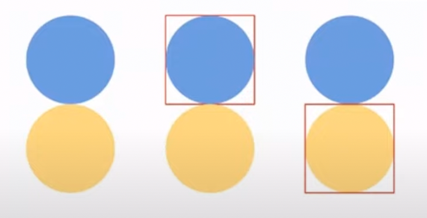

# フロントエンドの歴史を振り返りつつ概観を学ぶ
js の開発の変遷
- スクリプトタグの列挙
- タスクランナーによるファイルの結合
- webpack 等の build tool の登場

# JavaScript は環境によって様々な物がある
ECMAScript によって、仕様規定された言語

<details>
<summary>ECMAScript</summary>

JavaScript の標準化された仕様 https://262.ecma-international.org/13.0/
2015 年から毎年メジャーバージョンの仕様を更新していっている。 ECMAScript 2015, ECMAScript 2016, ...

例えば、 ECMAScript 2017 から async/await の仕様が公開されており、
最新の ECMAScript 2022 では トップレベル await が導入された。

ただ、最新の仕様ができあがったとしても、ブラウザ内のランタイム等がが対応しないと使えないので注意
各種ブラウザが ECMAScript の仕様に追随して実装していってくれている。
対応状況はここを見ると良い
- https://caniuse.com/?search=ECMAScript

</details>

ランタイムによって、言語の実装が異なる。
- ブラウザ
- Nodejs
- Deno など

シンタックスはほぼ同じなんだけど、実際にどう動くかはランタイム依存
基本的にそれぞれのランタイムはシングルスレッドで動くように実装されているので、並列処理はできないのだが、 worker と呼ばれるものに処理を委譲することで、並列処理を実現している。

あとで詳しくやります。

# ブラウザでの JavaScript
## スコープという概念がほぼない
当初はスコープの概念が関数内にしかなかった。(関数スコープ)
昔は var しかなかった。
ファイル直下に変数宣言すると、別ファイルから読み出せる(グローバルに定義される)

## 依存関係に注意
script タグは上から順番に読み込まれる
ファイル間で依存がある場合は依存に合わせて読み込む必要あり
a.js 内で定義してる関数を b.js で使用している場合は、 a を読み込んで b を読み込むみたいに書かないとダメ

## tutorial 1
https://github.com/yorisilo/frontend-sandbox を使う

``` shell
cd packages/tutorial-01
npm ci
npm run dev
```

# web ページ の表示
ページが表示されるまで
- URL にアクセスすると、サーバーから HTML が返却される
- HTML に記載されたリソースの取得が始まる

## web ページが表示されるまでの流れ
### html を取得するまで(HTTP 1.X)
- ブラウザにアドレスを入力
- DNS サーバーに問い合わせ (FQDN(ホスト + ドメイン名) -> IP)
- サーバーに HTML ファイルをリクエスト
- HTTP ヘッダーと HTML ファイルを取得

ここらへんの詳しいことを知りたい方はこちらへ
- https://github.com/yorisilo/go-httpd/blob/master/slide/02/network.md
- https://github.com/yorisilo/go-httpd/blob/master/slide/02/networkcomand.md

### html を取得してブラウザで web ページが表示されるまで
- HTML ファイルをパース
- CSS ファイル JS ファイルの参照を解析
- HTML をパース後、 DOM ツリーを生成
- CSS のパース後、 CSS ツリーを生成
- スタイルを DOM に反映する
- js をパースし、実行する

# リソース取得について
- HTTP1.X では、1 tcp コネクションにつき一つのリクエストしかできない。

<details>
<summary>コネクション</summary>
HTTP/1.0 ではリクエストのたびに tcp 3way hand-shake を行う。
- Header に Connection: keep-alive とすると、コネクションが維持される
- HTTP/1.1 では Connection: keep-alive ヘッダーを設定しなくてもデフォルトで keep-alive と同じ挙動をする

HTTP/2 では、1 tcp コネクションに対して複数のリクエストが可能

</details>

ブラウザのリソース取得
- 1つずつの取得は遅いので、ブラウザは複数の TCP コネクションを張るようになっている
  - chrome では6つ(ブラウザの実装依存だが大体 6つ) の TCP コネクションを張る(1オリジンに対して、6つ)

cf.
- [HTTP/1\.x のコネクション管理 \- HTTP \| MDN](https://developer.mozilla.org/ja/docs/Web/HTTP/Connection_management_in_HTTP_1.x)
- [そろそろ知っておきたいHTTP/2の話 \- Qiita](https://qiita.com/mogamin3/items/7698ee3336c70a482843)

## tutorial 2
https://github.com/yorisilo/frontend-sandbox を使う

``` shell
cd packages/tutorial-02
npm ci
npm run dev
```

# 仕様から見えてきた課題
- `*.js` の依存関係の解決
  - HTML に script タグを依存関係を考えて羅列するのはつらい
- ファイル数
  - ファイル数を減らすとロード完了までが優位になりやすい(ファイルサイズ等も問題にはなってくるが)

リソースの同時取得数に制限があることでページロードのパフォーマンス低下が課題
-> ファイル結合というアプローチが取られることになった。依存関係の順番で結合すればよし。

# タスクランナーの活用
## ファイル結合
JavaScript
- HTML に script タグを依存関係順に並べていたのを依存関係順に単純にファイルを結合し、 1つの `*.js*` ファイルにする
画像
- CSS スプライトによって、複数の画像を1つに結合し CSS で取得する

# ファイル結合 JavaScript
タスクランナー grunt, gulp の活用によって、複数の js ファイルを依存順に結合していた。

``` javascript
var concat = require('gulp-concat');

gulp.task('scripts', function() {
  return gulp.src(['./lib/file3.js', './lib/file1.js', './lib/file2.js'])
    .pipe(concat({ path: 'new.js', stat: { mode: 0666 }}))
    .pipe(gulp.dest('./dist'));
});
```

cf. https://github.com/gulp-community/gulp-concat

# ファイル結合 CSS スプライト
複数の画像を結合し、 CSS で位置調整・クリッピングし表示する。


青色丸も黄色丸も 500 x 1000 px とする。

``` javascript
var gulp = require('gulp');
var spritesmith = require('gulp.spritesmith');

gulp.task('sprite', () => {
    let spriteData = gulp.src('./app/images/sprite/*.png')
        .pipe(spritesmith({
            imgName: 'sprite.png',                        // スプライト画像
            cssName: '_sprite.scss',                      // 生成される CSS テンプレート
            imgPath: './public/assets/images/sprite.png', // 生成される CSS テンプレートに記載されるスプライト画像パス
            cssFormat: 'scss',                            // フォーマット拡張子
            cssVarMap: (sprite) => {
                sprite.name = "sprite-" + sprite.name;      // 生成される CSS テンプレートに変数の一覧を記述
            }
    }));
    spriteData.img
        .pipe(gulp.dest('./public/assets/images'));     // imgName で指定したスプライト画像の保存先
    return spriteData.css
        .pipe(gulp.dest('./app/styles/commons'));       // cssName で指定した CSS テンプレートの保存先
});

gulp.task('default', ['sprite']);
```

これを実行すると以下を行う
- 余白を削除して画像を敷き詰める
- それぞれの画像を取得する css を生成する

``` css
.blue {
  background: url(images/sprite.png) no-repeat;
  background-position: 0 0;
}
.yellow {
  background: url(images/sprite.png) no-repeat;
  background-position: 0 -500px;
}
```

ファイルの結合による利用コネクション数の削減以外でも利点があり、
- css の background に指定した画像は表示したときに初めてリクエストが飛ぶという仕様があり、たとえば、 hover したタイミングで画像を表示する UI の場合そのタイミングで画像を取得するので一瞬遅いとかがある。だが、 1ファイルにまとめられていると、最初になにかの画像が表示されたら他の画像のリクエストが飛ばずにすぐ表示されるというメリットもある。

cf. https://github.com/twolfson/gulp.spritesmith

# ファイル結合の現状
HTTP プロトコルの進化やブラウザ(HTML の仕様進化)の進化によって利用頻度は低下してきた

- HTTP/2 の登場: 1tcp コネクションで複数リクエストが送れるようになった
  - HTTP/2 に対応した CDN が気軽に使えるようになってきた
- head タグの中に書く `<link rel="preload"/ >` による先読み
- キャッシュヒット率を考慮すると、むしろ結合しないほうが有利なこともある。
  - 結合してしまうと、 100個のうち 1個変更があっただけでもすべての画像が入ったファイルを更新する必要があるが、画像が別れていると、そのファイルだけを更新すればよく、そのほかのファイルはブラウザキャッシュとして残る。

# ファイル数によるコネクション数削減については解消してきたが…
- js の依存関係の解決についてはまだ課題あり

# bundler の登場

# Node.js
- 2009 年に登場
- 作者は Ryan Dahl
- ブラウザとは異なる JavaScript の実行環境
- モジュールという概念を実装(CommonJS)
  - namespace が別れていて再利用可能な塊

# JavaScript の依存関係の解決 browserify
browserify
- Node.js 由来の require(CommonJS) を使ったコードを bundle して、ブラウザで動かせるようにするツール
  - require や module.exports はブラウザでは動かない
- このツールが登場したことでフロントエンドの js の世界に対して大きな転換期になった
- トップレベルで変数等を宣言してもグローバルスコープにならない
- この時期から、書いたコードを直接実行するのではなくて、ブラウザが読めるものに変換してからブラウザに読み込ませるという方法が普及しだした。

``` javascript
hello = (name) => {
  return `hello ${name}`;
}
module.exports = hello;
```

``` javascript
var hello = require("./hello.js");
console.log(hello("takeshi"));
```

## browserify の登場によって解決したこと
- require による依存関係の解決
  - Node.js でのみ使えていた require をいい感じにブラウザで使えるようにトランスパイルすることによって、ファイルが依存しているファイルという構造をコード上で表現可能になった。(require は npm パッケージも読み込める)
- npm package(https://www.npmjs.com/) の利用もできるようになった
  - nodejs のパッケージ群をブラウザでも利用できるようになった
  - 今までは、 script タグで CDN 経由で読み込んでたり、ローカルにダウンロードしてきたものを使ったりしていたが、その必要がなくなった。ユーザーとしては js で完結できるようになった。

# JavaScript の依存関係の解決 webpack
- [webpack](https://webpack.js.org/) の登場
- 最近は webpack や esbuild 等を使う事が多い
- 基本的には browserify と同様
- より広範囲のリソースをターゲットにした bundler
  - html, css, 画像等も JavaScript として扱う発想

## webpack
- js ファイル以外も import 可能になった。 `require('foo.css')` や `import foo from 'foo.css'` こんなことができる。
- CSS ファイルの場合(sass-loader を使えば scss とかも js で require できる)
  - css-loader が css ファイルの依存関係を解決
  - style-loader が style タグを head タグの子要素に追加する JavaScript を生成
  - webpack loader とは読み込んだファイルを JavaScript で実行できる形に変換するやつ
- ECMAScript Module だけではなく、 [webpack Modules](https://webpack.js.org/concepts/modules/) を利用する
  - css とかを module として扱える
  - ECMAScript Module では css を扱う仕様はないはず(つまり、ブラウザでは js の中で読み込んだ css をそのままでは利用できない)

# JavaScript トランスパイラ
最新の ECMAScript の仕様を使いたいということがある。
だが、ブラウザが対応してない場合はそのままでは使えない問題がある。
JavaScript をブラウザで動くような構文に変換してくれるツールのこと

## babel
- JavaScript 用のトランスパイラ
- ES2022 で書いた js ファイルを ES2015 に変換してくれたりする。

## tsc
- TypeScript 用のトランスパイラ
- TypeScript -> JavaScript に変換してくれる。
  - その際にどの ECMAScript のバージョンに変換するかも選べる

# CommonJS(require, module.exports) と ES Modules(import, export)
- Node.js では 2009 年に登場した CommonJS が採用されていたが、
- ECMAScript 2015 で登場した ES Modules も使用できるようになり、今は ES Module が主流である。
  - 現代のブラウザでは ECMAScript2015 (つまり ES Module に対応している) に対応していることが多い。

つまり、 ブラウザもサーバー(Node.js)も import/export でファイル依存を扱う時代に突入した。

# CSS in JS や Scoped CSS
react や vue の登場によってなんでも JS で扱う時代に突入し、import で css ファイルを読み込むというよりも、直接 js ファイルの中に css を書ける様になってきた。

# フロントエンドにおける JavaScript の概観まとめ
- リソースの最適化
  - grunt, gulp のようなタスクランナーの活用によって、ファイルをまとめる
  - HTTP/2, preload の活用によって grunt, gulp の時代が終焉
- 依存関係の解決
  - Node.js 由来の CommonJS(require) によるモジュールをブラウザの世界へ持ち込んだ bundler の登場
  - ECMAScript2015 以降では ESmodule が仕様策定されたので、 import/export がブラウザで動くようになった。
  - ただ、ファイル自体をまとめる bundle はまだ利用されている
- すべてを js に
  - html も css も js 内で完結させるコンポーネント思考なフロントエンドライブラリ(react, vue) の登場によって、 js だけでフロントエンドを書くという世界になってきている

# 参考
- [Frontend Developer Roadmap](https://roadmap.sh/frontend)
- https://mixi-developers.mixi.co.jp/21-technical-training-a0bcdbf9bca0#ab3d
