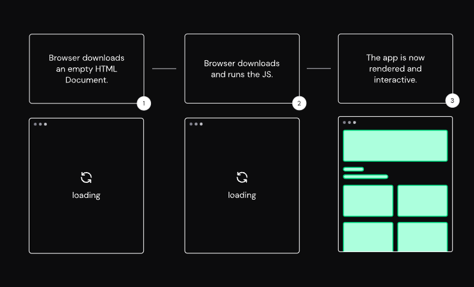
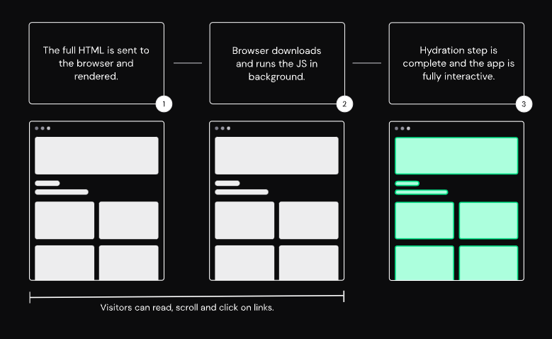

# Nuxt3
- [Nuxt: The Intuitive Web Framework](https://nuxt.com/)

# 特徴
- 自動ルーティング
- 自動インポート
  - Nuxt がデフォルトで設定してるディレクトリ配下にコンポーネントを入れると import せずにコンポーネントが使えたりする
  - Composition API 等も明示的に import せずに使用できる
- ディレクトリ構成
  - ディレクトリ名によって自動で機能が分かれる
- いろいろなレンダリングモードに対応
  - ユニバーサルレンダリング (SPA と SSR)
  - SSG 等

## 注意
- nuxt3 では nuxi コマンドを使うとする記事が多いが、現時点 ver 3.2.3 では nuxt は nuxi の alias になっているので、 nuxt コマンドを使ってもおｋ

# ディレクトリ構成
- cf. https://nuxt.com/docs/guide/directory-structure/nuxt

cf. [Nuxt\.jsにserverMiddlewareのHMRサポートが追加されました\(2020年3月18日追記\) \| 株式会社Japonline](https://www.japon-line.co.jp/tech/post/nuxt-js%E3%81%ABservermiddleware%E3%81%AEhmr%E3%82%B5%E3%83%9D%E3%83%BC%E3%83%88%E3%81%8C%E8%BF%BD%E5%8A%A0%E3%81%95%E3%82%8C%E3%82%8B%E4%BA%88%E5%AE%9A%E3%81%A7%E3%81%99/)
``` vue
// pages/index.vue
async getUser() {
    const user = await this.$axios.$get('/api/getUser')
}

// server/index.js
app.use('/getUser', async function(req, res, next) {
    try {
        const data = await DBやAPIリクエスト処理 // process.env.secret_keyなどで参照
        res.status(200).json(data)
    } catch (err) {
        res.status(400).json(...)
    }
})
```

cf. [Nuxt3のserver/apiとuseFetchを使用してShopifyへサーバーAPIリクエストを実装 \- 独学プログラマ](https://blog.cloud-acct.com/posts/nuxt3-shopify-server-api-request/#%E5%95%86%E5%93%81%E4%B8%80%E8%A6%A7%E3%82%92%E5%8F%96%E5%BE%97%E3%81%99%E3%82%8Bapi%E3%82%92%E4%BD%9C%E6%88%90%E3%81%99%E3%82%8B)

## .next/
nuxt dev 実行時に生成される仮想的なファイルシステム
たとえば、 Nuxt が自動インポートするためにここに随時変更が入ったりする。 なので、 nuxt dev は基本的に開発時は実行しっぱなしにする。
基本的にいじらない。

## .output/
nuxt build すると生成物がここに吐き出される。
本番環境にデプロイするときはこのディレクトリを使用する

## components/
- 自動インポートが有効
- 自作のコンポーネントを置く場所。

## pages/
- 自動インポートが有効
ルーティングしたいコンポーネントを入れておく場所。
ファイル名を適切に命名すると Nuxt のルールによってルーティングをいい感じにしてくれる。

pages ディレクトリ配下のコンポーネントは単一ルートである必要がある。(vue3 は複数 root でもおｋ)
:x:

``` vue
<template>
  <h1>Welcome to the homepage</h1>
  <Hoge>hoge</Hoge>
</template>
```

:o:

``` vue
<template>
  <div>
    <h1>Welcome to the homepage</h1>
    <Hoge>hoge</Hoge>
  </div>
</template>
```

## composables/
- 自動インポートが有効
- 自作の composables(react でいう custom hooks) を置いておく場所

デフォルトエクスポートでも利用できるが、名前付きエクスポートを推奨する

composables/foo.ts
``` typescript
export const useFoo = () => {
  return useState('foo', () => 'bar')
}
```

## layouts/
- アプリケーション全体のレイアウト用のコンポーネントを置く場所
- page コンポーネント内で、 `<NuxtLayout>` を使用すれば使える

## middleware/
- Route Middleware を置く。 serverMiddleware とは違う
- Route Middleware は、サーバーサイド・クライアントサイドともに、ルーティング（ページ遷移）にあたって行う共通処理を記述することができる。
- コンポーネントが setup される前にページ遷移に先立ち、 middleware の指定のファイルが実行される。
- defineNuxtRouteMiddleware 関数をデフォルトエクスポートする必要がある。
- page コンポーネント内で definePageMeta を利用することで、 middleware 内のコードを利用できる。

middleware/logs.ts
``` typescript
export default defineNuxtRouteMiddleware(context) => {
  console.log('ミドルウェア実行')
}
```

- [Nuxt 3 の Route Middleware で簡単な認証フローを構築する](https://zenn.dev/coedo/articles/route-middleware-nuxt3)

## server/
サーバーサイドで処理させたいものを置く場所
- server/api/
- server/routes/
- server/middleware/
以下に作成する
- それぞれのファイルは defineEventHandler 関数をデフォルトエクスポートする必要がある。
- これらの関数は、 サーバーサイドで利用するときは直接 API を叩き、 クライアントサイドで叩く場合は http 通信経由で叩くことになる。 Nuxt ではそこの違いを意識せずに defineEventHandler で作っておけば良い。

### server/api/
いわゆる web api を置く場所

server/api/hello.ts
``` typescript
export default defineEventHandler((event) => {
  return {
    api: 'works'
  }
})
```

この API を利用するには `await $fetch('/api/hello')` とすれば良い

### server/routes/

server/routes/hello.ts
``` typescript
export default defineEventHandler(() => 'Hello World!')
```

これを定義すると、 `http://localhost:3000/hello` でアクセスできる

### server/middleware/
ここに定義したものは、サーバーへのリクエストに対して実行させることができる。共通で利用する認証処理やログの収集時に使うと良さそう。

server/middleware/logging.ts

``` typescript
export default defineEventHandler((event) => {
  console.log('New request: ' + event.node.req.url)
})
```

# 状態管理
- useState
- Pinia
- Vuex
Nuxt で状態管理を複数コンポーネントで扱う場合は上記の選択肢があるが、今回は、 useState を見ていく。

## useState
- Nuxt3 で提供されるコンポーネント間で共有できる state の composable
- SSR friendry な ref()
- シリアライズできるものだけを使うこと
- vuex などと同様にブラウザリロードしたら消える

<details>
<summary>シリアライズ</summary>

データを特定の形式に変換すること。一般に可逆的なものである。シリアル化したものを復元するとデータは元の形式に戻すことができる。 シリアル化する前 <-> シリアル化した後
ただし、オブジェクトに関数が含まれていると、関数の部分だけ除外されて、シリアライズされるので注意(この場合は可逆性は成り立ってない)

</details>

ログインユーザー情報を複数コンポーネントで使えるよう、useStateで状態変数を定義してみる。
key を元に子コンポーネントで、親コンポーネントの state を参照できる。つまり、すごくネストした子コンポーネントに対しても、 key だけで参照できる。
ref でやろうとすると、 props のバケツリレーが必要。

pages/user.vue
``` vue
<script lang="ts" setup>
const user = useState<{ id: string, name: string, mail: string }>('login-user', () => {
  console.log('retrieving user info...')
  return {
    id: '012345',
    name: 'hogehoge',
    mail: 'hoge@fuga.com'
  };
})
</script>

<template>
  <div>
    <h1>useState実装例</h1>
    <NuxtLink to="/user-detail"> {{ user.name }}さんの詳細ページへ</NuxtLink>
  </div>
</template>
```

pages/userDetail.vue
``` vue
<script lang="ts" setup>
const user = useState<{ id: string, name: string, mail: string }>('login-user')
</script>

<template>
  <div>
    <p>ユーザーID: {{ user.id }}</p>
    <p>ユーザー名: {{ user.name }}</p>
    <p>メールアドレス: {{ user.mail }}</p>
  </div>
</template>
```

cf.
- [Nuxt 3 \+ TypeScript で状態管理（useState編）](https://zenn.dev/coedo/articles/use-state-nuxt3)
- [Nuxt3入門\(第8回\) \- Nuxt3のuseStateでコンポーネント間で状態を共有する \| 豆蔵デベロッパーサイト](https://developer.mamezou-tech.com/nuxt/nuxt3-state-management/)

# レンダリングモード
- Nuxt3 では、レンダリングモードとして、 クライアントサイドオンリーなレンダリングとユニバーサルレンダリングをサポートしている。

## クライアントサイドオンリーなレンダリング
- まず空の HTML をダウロードし、それから js をダウンロードし実行する
- すると、 完全な HTML がレンダリングされ、インタラクティブなページを構成する


## ユニバーサルレンダリングモード
- まず、サーバーサイドで完全な HTML をレンダリングし、クライアントへ
- クライアントはバックグラウンドで js をダウンロードし、インタラクティブなページを再構成する(ハイドレーションステップ)


cf.
- [Rendering Modes · Nuxt Concepts](https://nuxt.com/docs/guide/concepts/rendering)

## ハイブリッドレンダリング
Nuxt3 ではルートごとにレンダリングのタイプを変更することができる

nuxt.config.ts
``` typescript
export default defineNuxtConfig({
  routeRules: {
    '/admin/**': { ssr: false }, // client only rendering (CSR)
    '/foo': { ssr: true, prerender: false }, // universal rendering (SSR)
    '/bar/home': { ssr: true, prerender: true }, // SSG
  },
});
```
Nuxt3 では `ssr: true` がデフォルト値

- CSR, SSR としたルートでは、 HTML は事前に生成されない。CSR, SSR では HTML はクライアントサイドやサーバーサイドでリアルタイムに生成されるので、 nuxt build したタイミングでは生成されない。
- SSG については、事前に HTML が生成される。(SSR と SSG は HTML の生成タイミングが異なるだけ。 SSR はアクセス時、 SSG は build 時)
- SSR, SSG どちらかを使うかの判断だが、最新コンテンツを提供したいという意図では SSR, それ以外のものは SSG を採用すると良い。基本的に SSG のほうが事前に HTML を生成しているのでパフォーマンスが良い
- ISG/ISR という SSR と SSG のメリットを取り入れたレンダリング手法も存在するが、 Nuxt3 では Netlify/Vercel を利用することでそのレンダリング手法も利用できる(らしい)

cf.
- [Nuxt3で導入されたハイブリッドレンダリングとNuxt版ISG/ISRを試してみる \| 豆蔵デベロッパーサイト](https://developer.mamezou-tech.com/blogs/2022/12/18/nuxt3-hybrid-rendering/)


## デプロイについて

``` shell
# デフォルト：ユニバーサルレンダリング(プリレンダリング無効:target->server)
npm run build
# Nitroサーバーエンジン起動
node .output/server/index.mjs

# ユニバーサルレンダリング(プリレンダリング有効:target->static) または クライアントサイドレンダリング(SPA)
npm run generate
# dist以下をホスティング
```

# 実際の開発の流れ

cf.
- [Nuxt3入門\(第2回\) \- 簡単なNuxtアプリケーションを作成する \| 豆蔵デベロッパーサイト](https://developer.mamezou-tech.com/nuxt/nuxt3-develop-sample-app/)
- [Nuxt3入門\(第3回\) \- ユニバーサルフェッチでデータを取得する \| 豆蔵デベロッパーサイト](https://developer.mamezou-tech.com/nuxt/nuxt3-universal-fetch/)

## 参考
cf.
- [Nuxt 3 State Management: Pinia vs useState \| Vue Mastery](https://www.vuemastery.com/blog/nuxt-3-state-mangement-pinia-vs-usestate/)
- [Nuxt3入門\(第1回\) \- Nuxtがサポートするレンダリングモードを理解する \| 豆蔵デベロッパーサイト](https://developer.mamezou-tech.com/nuxt/nuxt3-rendering-mode/)
- [Nuxt3のComposablesとuseStateと状態管理 \- くらげになりたい。](https://www.memory-lovers.blog/entry/2022/06/04/180000)
