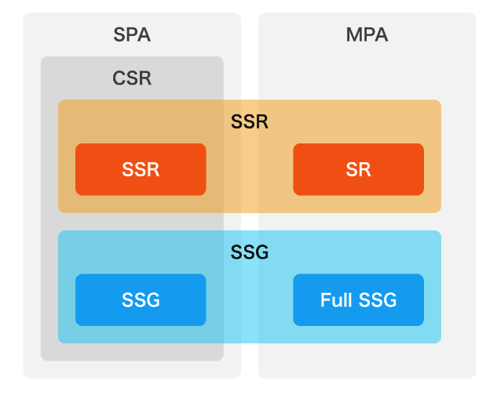

# SPA MPA CSR SSR 等について
- [SPA/MPAとCSR/SSR/SSGの分類](https://zenn.dev/mt877/articles/6dc3afe99ee794)
- [SPA\(Single Page Application\)と利用されるレンダリング技術まとめ \| yutaro blog](https://yutaro-blog.net/2021/12/03/spa-csr-ssr-ssg-sg/)

# SPA
1つの HTML ファイルでページのコンテンツをすべて管理し、表示する手法
js の DOM API で最上位の子要素を入れ替えて、表示を切り替えることで、HTML としては1枚だが、異なるコンテンツを表示することを可能にする。
history API を活用することで、1枚の HTML ファイルを使用しながら、ブラウザの履歴情報を追加し、表示コンテンツごとに URL を表現できる

- 更新差分データを取得
- 新データを反映した Element の生成
- DOM ツリーに新しい Element を反映

# MPA
- 新データを反映した HTML ファイルをリクエスト
- ページを 0 から再構築
- HTML, CSS, JS すべてのパースと実行が完了してからページを描画

# CSR

# SSR
- [Nuxt\.jsにおけるサーバーサイドレンダリングの挙動とライフサイクル \- nazolabo](https://nazo.hatenablog.com/entry/nuxt-ssr-lifecycle)
- [Nuxt\.jsでvuexとlocalStorageをあわせて使う方法](https://zenn.dev/koojy/articles/nuxt-localstorage)
