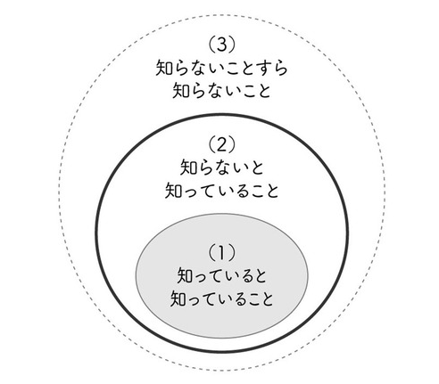

# フロントエンド勉強会
[Frontend Developer Roadmap](https://roadmap.sh/frontend) を見ると圧倒されると思うが、自分もわからないことは多いです。
また、理解度のグラデーションもそれぞれの項目で様々です。

[Frontend Developer Roadmap](https://roadmap.sh/frontend) にも書いてあるとおり、すべてを把握しなければならないと気負う必要はないです。

> Should I learn everything listed on the Frontend Roadmap?
> This roadmap contains everything that you might encounter while working as a Frontend Developer. You may not need everything listed on this roadmap to get into the industry; every job is different and most of the jobs will require a subset of the items on the roadmap. However, knowing what you don't know is as important as knowing things, so you can use this roadmap to get an idea of what you are missing as well.
>
> If you are a beginner who is just getting started, don't feel overwhelmed by looking at this roadmap. Look at the answer to the FAQ 'How to become a Frontend Developer?'

> このロードマップには、フロントエンド開発者としての作業中に遭遇する可能性のあるすべてが含まれています。業界に参入するために、このロードマップにリストされているすべてが必要なわけではありません。すべての仕事は異なり、ほとんどの仕事はロードマップ上の項目のサブセットを必要とします。ただし、知らないことを知ることは、物事を知ることと同じくらい重要であるため、このロードマップを使用して、何が欠けているかを理解することもできます。
>
> 始めたばかりの初心者の方は、このロードマップを見て圧倒されないでください。FAQ「フロントエンド開発者になるには？」の回答を見てください。

知らないという状態も細分化できる
- 知らないことすら知らない
- 知らないことを知っている

この勉強会を通して
- 知らないことすら知らない -> 知らないと知っているというステップへ進むことができればうれしい
  - 知らないと知っていれば、取るべき方針が立てられると思っています。

