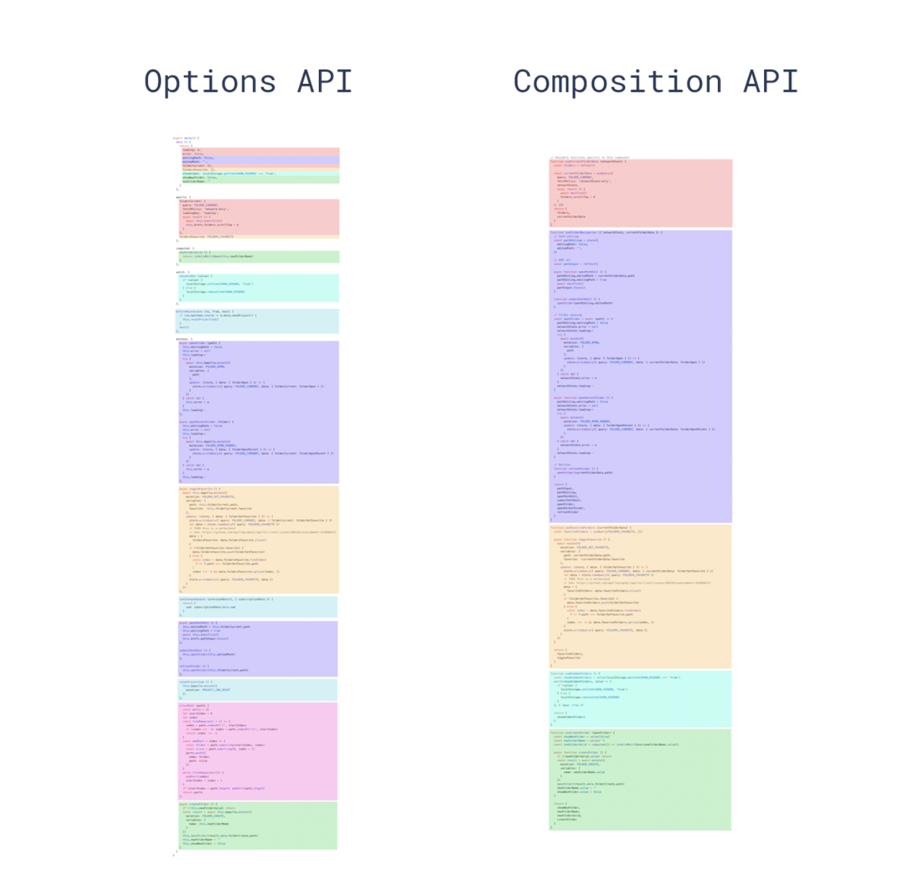
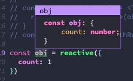
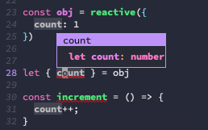
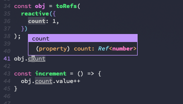
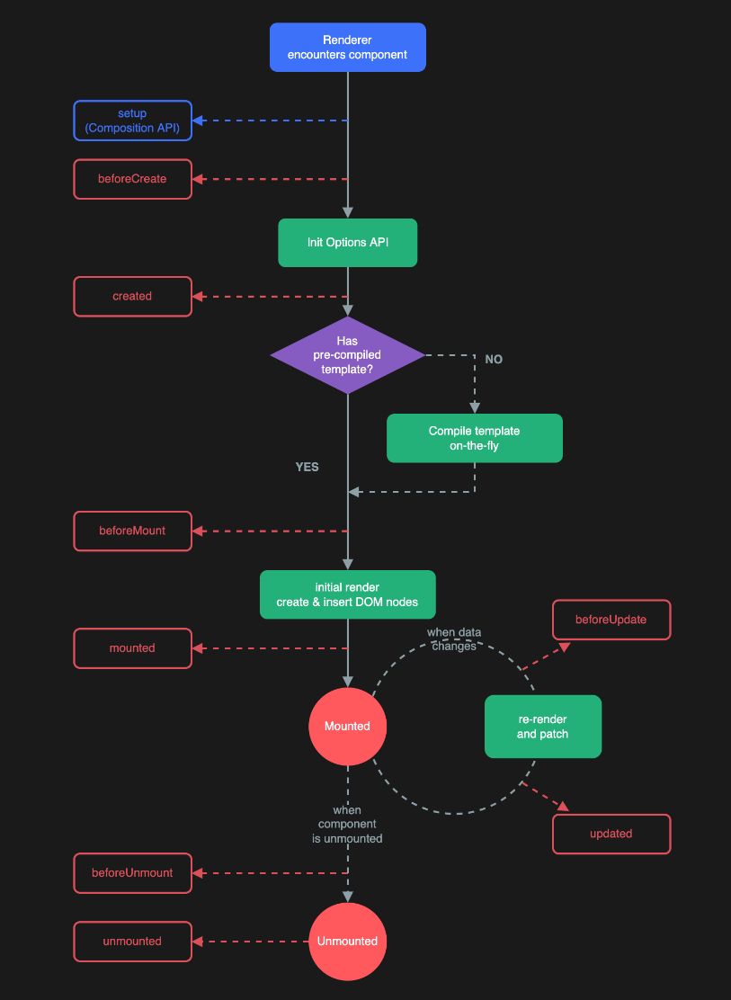
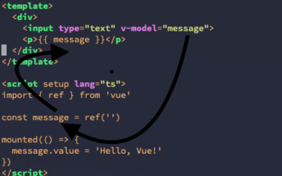

# Vue/Nuxt3

# 流れ
## vue2 vs vue3
- vue2 と vue3 の書き方の違いを具体的に見つつ、どの点が vue3 のほうが優れているのかを説明していく
- vue2 Optinos API と Composition API
- ディレクティブ

## 演習
- 演習にて vue2(options api) -> vue3(options api) -> vue3(composition api) へ書き直していく。
  - SPA かつ CSR の実装だったので、 SPA かつ SSR にすべく、 Nuxt3 を導入する。

# Vue.js
[Vue\.js \- The Progressive JavaScript Framework \| Vue\.js](https://ja.vuejs.org/)
- 宣言的 UI を導入したフロントエンドフレームワーク

## 命令的な UI(宣言的じゃない UI)
- html タグを命令的に記述して行くことで UI を作成していく

``` javascript
const main = document.createElement("main");

let message = "hello!";

const input = document.createElement("input");
input.value = message;
input.addEventListener("input", inputHandler);

main.appendChild(input);

const p1 = document.createElement("p");
p1.innerHTML = message;

main.appendChild(p1);

const p2 = document.createElement("p");
p2.innerHTML = message.toUpperCase();

main.appendChild(p2);

document.body.appendChild(main);
```

## 宣言的 UI
- html タグをすでに `宣言` している状態で UI を作成していく

``` html
<template>
  <main>
    <input type="text" v-model="message">
    <p>{{ message }}</p>
    <p>{{ message.toUpperCase() }}</p>
  </main>
</template>
```

# Vue2 vs Vue3
色々と変わっているので詳しくはここを見るべし: [Vue 3 Migration Guide \| Vue 3 Migration Guide](https://v3-migration.vuejs.org/)
- Composition API の導入
  - TypeScript との親和性が上がり、Class コンポーネントではなく関数コンポーネントで書くようになり React のような書き心地になった。React hooks のような仕組みが導入された。
- script setup の導入
  - setup() 関数を使わずに、script タグ内のトップレベルでロジックを定義できるようになった。
- 各種ディレクティブの使い方/挙動の変更
  - v-model などの使い方/挙動が変わった

たとえば、エントリポイントのコードもこんな感じで変わってる。

vue2
``` vue
import Vue from 'vue'
import App from './App.vue'
import router from './router'

Vue.use(router)

new Vue({
  render: (h) => h(App),
  router
}).$mount('#app')
```

vue3
``` vue
import { createApp } from "vue";
import App from "./App.vue";
import router from "./router";

const app = createApp(App);

app.use(router);

app.mount("#app");
```

- createApp 関数でアプリケーションを作成し、引数にルートコンポーネントを指定する。
- app.use() を使用して、Vue Router をアプリケーションに統合する。
- app.mount() を使用して、アプリケーションを特定の要素にマウントする。id が app の要素を対象にしている。

## リアクティブ
- リアクティブ: Vue.js では、値の変更を検知し、それに応じて自動的にビューを再レンダリングする機能を指す
vue2 では data 内がリアクティブなデータになり, vue3 から ref or reactive という関数を使うことで、リアクティブなデータを作成できる。


## `<script setup>` 構文
cf.
- [【Vue3】script setup構文の使用方法とメリット【propsとemitsも解説】 \- TeKRog](https://tekrog.com/vue3-script-setup/)

## Options API vs Composition API
cf. https://vuejs.org/guide/extras/composition-api-faq.html#more-flexible-code-organization

script タグの中のデータとロジックのまとまりを色で分けている。


Options API

``` html
<template>
  <div>
    <p>{{ count }}</p>
    <button @click="increment">Increment</button>
  </div>
</template>

<script>
export default {
  data() {
    return {
      count: 0
    };
  },
  methods: {
    increment() {
      this.count++;
    }
  }
};
</script>
```

- data
リアクティブな値を定義する場所
Options API の data オプションは、コンポーネントの内部状態を管理するために使用されるオブジェクトであり、そのオブジェクトに含まれるプロパティは、Vue.js が自動的にリアクティブな変数として追跡し、変更があった場合には再レンダリングをトリガーする。
- methods
再描画されたときに常に関数を実行する
- computed
リアクティブな値を computed 内部で使っている場合に、その値が更新されたら、再計算されて実行される。それ以外は、再実行されずに一度計算された結果が返る。

Composition API
- `<script setup>` を利用することで、 vue2 の data, methods, computed, ライフサイクルフック(mounted, updated, ...) をそのタグ内部に収めることができる。
- data -> ref, reactive
- methods -> `<script setup>` 内で書いた関数 (setup 関数内で書いた関数)
- computed -> computed 関数
- ライフサイクルフック
  - created -> `<script setup>` 内
  - mounted -> onMounted 関数
  - updated -> onUpdated 関数
  - ...

``` html
<template>
  <div>
    <p>{{ count }}</p>
    <button @click="increment">Increment</button>
  </div>
</template>

<script setup lang="ts">
import { ref } from 'vue';

const count = ref(0);

const increment = () => {
  count.value++;
}
</script>
```


<details>
<summary>setup()関数を使用した場合: 非推奨</summary>

``` vue
<template>
  <div>
    <p>{{ count }}</p>
    <button @click="increment">Increment</button>
  </div>
</template>

<script setup lang="ts">
import { ref } from 'vue';

export default {
  setup() {
    const count = ref(0);

    const increment = () => {
      count.value++;
    }

    return {
      count,
      increment
    };
  }
};
</script>
```

</details>

# Composition API
## ref
リアクティブなデータを作るためのもの

``` vue
const count = ref(0);

// count 自体は Ref 型なので、 実際の値にアクセスするには .value を付ける必要あり
count.value
```

``` vue
const firstName = ref('Jhon');
const lastName = ref('Smith');
const age = ref(21);

const fullName = computed(() => `${firstName.value} ${lastName.value}`);
```

## reactive
リアクティブなデータを作るためのもの
(オブジェクトとして定義して、それぞれのプロパティがリアクティブになる。 ref() でオブジェクトを定義した場合はオブジェクト全体はリアクティブではあるが、個別のプロパティはリアクティブではない)

``` vue
const obj = reactive({
  count: 0
})

// reactive の場合は、 Ref 型ではないので、 .value を付ける必要なし
obj.count
```

``` vue
const user = reactive({
  firstName: 'Jhon',
  lastName: 'Smith',
  age: 21,
});

const fullName = computed(() => `${user.firstName} ${user.lastName}`);
```

ただし、 reactive で定義したオブジェクトの型は Ref 型ではないので、リアクティブなデータなのかの判別がしにくい。


また、 分割代入した場合は、リアクティブ性が失われるので注意



toRef で包んであげると、分割代入しても、リアクティブ性が保たれる。



(正直 reactive は使わずに ref だけを使うので良いと思ってる。わかりにくいし)

cf.
- [Vue Composition APIのrefとreactiveを解説！違いと使い分け－こばてくブログ](https://kobatech-blog.com/vue-composition-api-ref-reactive/)

## computed
リアクティブな値を computed 内部で使っている場合に、その値が更新されたら、再計算されて実行される。それ以外は、再実行されずに一度計算された結果が返る。
リアクティブな値を使って計算した結果がほしいときはこれを使うとよい。

``` vue
const firstName = ref('Jhon');
const lastName = ref('Smith');
const age = ref(21);

const fullName = computed(() => `${firstName.value} ${lastName.value}`);
```

## watch
あるリアクティブな値を監視し、それの変更に合わせて副作用を実行したいときに使う。
computed に似てるが、以下に当てはまるときは watch 系の API(watch, watchEffect,...) を使うと良い。
- computed プロパティでは処理できない非同期通信などの複雑な処理を行う場合
- 更新前と更新後の値を使う場合
- 処理を実行しても、データは返さない場合


``` vue
watch(count, (newCount, oldCount) => {
  console.log(`newCount: ${newCount}, oldCount: ${oldCount}`);
});
```

## nextTick
DOM の更新を明示的に待つ
cf. https://ja.vuejs.org/api/general.html#nexttick

``` vue
<script setup>
import { ref, nextTick } from 'vue'

const count = ref(0)

async function increment() {
  count.value++

  // DOM はまだ更新されていない
  console.log(document.getElementById('counter').textContent) // 0

  await nextTick()
  // ここでは DOM が更新されている
  console.log(document.getElementById('counter').textContent) // 1
}
</script>

<template>
  <button id="counter" @click="increment">{{ count }}</button>
</template>
```

# ライフサイクルフック
cf.
- [ライフサイクルフック \| Vue\.js](https://ja.vuejs.org/guide/essentials/lifecycle.html)
- [Composition API: ライフサイクルフック \| Vue\.js](https://ja.vuejs.org/api/composition-api-lifecycle.html)



:+1: がよく使うライフサイクルフック
- beforeCreate: コンポーネントが作成される前に呼び出される。データやメソッドはまだ初期化されてない。
- :+1: created: コンポーネントが作成された直後に呼び出される。データやメソッドは初期化されている。
- beforeMount: コンポーネントがDOMにマウントされる前に呼び出される。
- :+1: mounted: コンポーネントがDOMにマウントされた直後に呼び出される。DOM にアクセスするときに利用できる。ただし、非同期的なコンポーネントがある場合はそのマウントまでは保証しない。すべての DOM がマウントされた後に処理をしたい場合は nextTick を使うと良い。
- beforeUpdate: コンポーネントが更新される前に呼び出される。
- updated: コンポーネントが更新された直後に呼び出される。様々な状態変更によるコンポーネントの DOM 更新の後に呼び出されるので、注意して使用すること
- beforeUnmount: コンポーネントがアンマウントされる前に呼び出される。
- :+1: unmounted: コンポーネントがアンマウントされた直後に呼び出される。

## コンポーネントが作成
コンポーネントのインスタンスを生成したタイミングを指す

## DOMにマウント
仮想 DOM にレンダリングした後に、実際の DOM にマウントした直後のことを指す
ブラウザがDOMをレンダリングすることは、Vue.jsの制御外のため、ブラウザによってレンダリングの完了時期が異なることがあることには注意

## アンマウント
コンポーネントが表示されなくなったりしたとき

# 各種ディレクティブの使い方/挙動の変更
- [ビルトインのディレクティブ \| Vue\.js](https://ja.vuejs.org/api/built-in-directives.html)
## マスタッシュ構文
要素のテキストを更新する

``` html
<span v-text="msg"></span>
<!-- same as -->
<span>{{msg}}</span>
```

## v-model
フォーム入力要素またはコンポーネントに双方向バインディングを作成する。
(vue2 と vue3 で使い方が異なるので注意)



### フォームの場合
``` html
<template>
  <div>
    <input type="text" v-model="message">
    <!-- 以下と同じ -->
    <input type="text" :value="message" @input="message = $event.target.value">
    <p>{{ message }}</p>
  </div>
</template>

<script setup lang="ts">
import { ref } from 'vue'

const message = ref('')

// inputValue を @input に渡しても良い
// @input 内では、 $event にする必要があるが、メソッドの場合は $ は必要ない。また、引数に event を入れなくても良い。
const inputValue = () => {
  message.value = event.target.value;
};

mounted(() => {
  message.value = 'Hello, Vue!'
})
</script>
```

<details>
<summary>React は基本的に単方向データバインディング</summary>

https://codepen.io/tamago3keran/pen/eYBgbQv

</details>


### カスタムコンポーネントの場合
子コンポーネントの変更を親コンポーネントに反映させたいときに使うと良い。
カスタムコンポーネントで使用する場合は 子コンポーネント側で emit が必要なので注意

- 親コンポーネントから子にデータを渡したい場合は props
- 子コンポーネントから親にデータを渡したい場合は emit を利用する

cf. [【Vue\.js3】カスタムコンポーネントでv\-modelを使う方法](https://tekrog.com/v-model-in-vue3/)


親コンポーネント
``` vue
<Child v-model="text"/>
```

子コンポーネント

``` vue
<script lang="ts" setup>
const props = defineProps<{modelValue: string}>()
const emits = defineEmits<{(e: 'update:modelValue', text: string): void}>()

const onInputText = (e: Event) => {
  const target = e.target as HTMLInputElement
  emits('update:modelValue', target.value)
}
</script>

<template>
  <input :value="modelValue" type="text" @input="onInputText" />
</template>
```

### 双方向データバインディングと単方向データバインディング
双方向データバインディング: データをテンプレートに表示するだけでなく、テンプレートからデータを更新することができる機能のこと。また、親のコンポーネント <-> 子コンポーネントの双方向のデータ更新等も含む

## v-on `@`
イベントリスナーを登録するやつ
- click
- change
- input イベント
に対して何らかのハンドラを登録する。

## v-bind `:`
主に、子コンポーネントの props にリアクティブなデータを渡すときに使う

## v-if
レンダリングする/しないを判断するやつ

## v-show
v-if に似てるが、その要素はレンダリング自体はされてるが、 css によって display: none が設定されるだけ。

## v-for
配列やオブジェクトを一個ずつ取り出してレンダリングするやつ

例
``` html
<li v-for="item in items">
  {{ item.message }}
</li>
```

## v-slot `#`
React でいう children に近いやつ

親コンポーネントから子コンポーネントを呼び出すときに、子コンポーネントで別のコンポーネント等を wrap し、そのコンポーネントを子コンポーネントで利用するやつ

親コンポーネント
``` vue
<template>
  <Child>
    <template v-slot:header>ヘッダー</template>
    <template v-slot:body>コンテンツ</template>
    <template v-slot:footer>フッター</template>
  </Child>
</template>
```

子コンポーネント
``` vue
<template>
  <div>
    <slot name="header"></slot>
    <slot name="body"></slot>
    <slot name="footer"></slot>
  </div>
</template>
```

cf. [スロット \| Vue\.js](https://ja.vuejs.org/guide/components/slots.html)

# composables
React の custom hooks みたいなやつ
cf. [Composables \| Vue\.js](https://vuejs.org/guide/reusability/composables.html)

# vue3 で新たに追加された provide/inject
- props/emit
- provide/inject

# class component vs vue-property-decorator (ts) vs vue extend (ts) vs script setup
- [vue\-property\-decorator \+ TypeScriptで書かれたVueコンポーネントをscript setupで書き換える](https://zenn.dev/r57ty7/articles/53d189afa27aeb)
- [TypeScriptでVueコンポーネントを開発する方法 \| NHN Cloud Meetup](https://meetup-jp.toast.com/1843)

cushion は、 vue.extend を使ってる

# SFC (Single File Component)
hgoe.vue 形式の以下のようなファイル(template, logic, style を一つにまとめるやりかた)。いわゆるコンポーネント思考なファイル構造
この形式で書くと、 build tool が必要


``` vue
<template>
  <p class="greeting">{{ greeting }}</p>
</template>

<script>
export default {
  data() {
    return {
      greeting: 'Hello World!'
    }
  }
}
</script>

<style>
.greeting {
  color: red;
  font-weight: bold;
}
</style>
```

- [単一ファイルコンポーネント \| Vue\.js](https://v3.ja.vuejs.org/guide/single-file-component.html#%E5%89%8D%E6%9B%B8%E3%81%8D)
- [SFC 構文の仕様 \| Vue\.js](https://v3.ja.vuejs.org/api/sfc-spec.html)

# vue2 -> vue3 の違い
- [【Vue 3】Composition API の基本](https://b1san-blog.com/post/vue/vue-3-composition-api/)
- [Composition API \| Vue\.js](https://v3.ja.vuejs.org/api/composition-api.html)
- [Moving from Vue 2's Option API to Vue 3's Composition API \- Terabyte Tiger](https://terabytetiger.com/lessons/moving-from-vue-2-to-vue-3-composition-api)

# Nuxt3
cf.
- [Nuxt: The Intuitive Web Framework](https://nuxt.com/)
- [神回\|vue3\.js nuxt3 typescriptどうやる？【ゼロから解説】 \| 合同会社FIELD](https://field.asia/%E7%A5%9E%E5%9B%9Evue3-js-nuxt3-typescript%E3%81%A9%E3%81%86%E3%82%84%E3%82%8B%EF%BC%9F%E3%80%90%E3%82%BC%E3%83%AD%E3%81%8B%E3%82%89%E8%A7%A3%E8%AA%AC%E3%80%91/)

## 状態管理
useState

- [Nuxt3入門\(第8回\) \- Nuxt3のuseStateでコンポーネント間で状態を共有する \| 豆蔵デベロッパーサイト](https://developer.mamezou-tech.com/nuxt/nuxt3-state-management/)
- [Nuxt3のComposablesとuseStateと状態管理 \- くらげになりたい。](https://www.memory-lovers.blog/entry/2022/06/04/180000)

# 参考
- [過去のコードをComposition APIを使って書き直してみる（前編） : ビジネスとIT活用に役立つ情報（株式会社アーティス）](https://www.asobou.co.jp/blog/web/composition-api1)
- [プロパティ — Vue\.js](https://jp.vuejs.org/v2/guide/components-props.html)
- [Nuxt\.js使ってみた Part5~小ネタ:propsとdataの違い編~ \- Aikの技術日記](https://aik0aaat.hatenadiary.jp/entry/2020/07/05/213041)
- [【Vue3】Vue\.jsのデータフローおさらい！ ｜エンジニアBLOG｜株式会社クラウドスミス](https://cloudsmith.co.jp/blog/frontend/2020/12/1656030.html)
