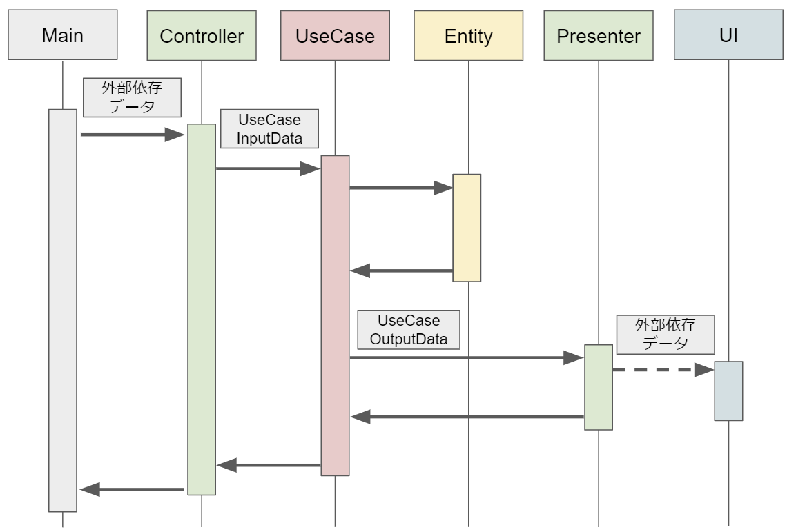

2018-11-14 18:34:38

# クリーンアーキテクチャについて
依存関係をコントロールし持続可能なソフトウェアを実現するための体系的な手法

俺の clean architecture はこんな感じだぜ！どう？どう？っていろんな記事がアップされてるので未だに右往左往してしまう。
が、
基本的には以下を守ればどれもクリーンアーキテクチャなので、お前だけのクリーンアーキテクチャを作ってこうな！ということだと思う。

* レイヤーを4つほどに分ける。 ex. external-> adapter -> usecase -> domain
* 外から内にだけ依存がある。(内側のコンポーネントは外側のことを知らない)
* 依存するときはインターフェースとか使って実装と分離させる。
* 依存ルールが逆転(内が外に依存してしまいそうな)しそうなときはDIPを使って依存ルールを守る

DIP：クリーンアーキテクチャの文脈だと、外側の層のコンポーネントを使いたくなったら、そのインターフェースを自分の層に置いてそれを使う。

クリーンアーキテクチャの文脈だとマジでそれだけ。

## DIP に関して

## 参考
私はクリーンアーキテクチャに関する記事を15個くらい読んでめちゃくちゃ混乱したので、これと決めたら一旦その記事だけ読んで実装するのがいいかも…
おすすめは以下のもの。 DIP に関する記事は深みにハマるとよくわからなくなるので、前述したクリーンアーキテクチャの文脈での DIP だけとりあえずわかっておけばおk。

原典
* [Clean Coder Blog](http://blog.cleancoder.com/uncle-bob/2012/08/13/the-clean-architecture.html)

基本的にこれを参考にして、
* [Goでクリーンアーキテクチャを試す | POSTD](https://postd.cc/golang-clean-archithecture/)

DIコンテナの部分、 external の使い方などは以下を参考にした。
* [クリーンアーキテクチャの書籍を読んだのでAPIサーバを実装してみた - Qiita](https://qiita.com/yoshinori_hisakawa/items/f934178d4bd476c8da32)
* [Clean ArchitectureでAPI Serverを構築してみる - Qiita](https://qiita.com/hirotakan/items/698c1f5773a3cca6193e)

他
* [別視点から理解するクリーンアーキテクチャと適用限界 - Qiita](https://qiita.com/kotauchisunsun/items/66c8946994344e19b1a8)
* [実践クリーンアーキテクチャ │ nrslib](https://nrslib.com/clean-architecture/)
* [Clean Architecture 達人に学ぶソフトウェアの構造と設計【委託】 - 達人出版会](https://tatsu-zine.com/books/clean-architecture)
* [クリーンアーキテクチャの書籍を読んだのでAPIサーバを実装してみた - Qiita](https://qiita.com/yoshinori_hisakawa/items/f934178d4bd476c8da32)
* [【ボブおじさんのClean Architectureまとめ】オブジェクト指向 ~SOLIDの原則~ - Qiita](https://qiita.com/yoshinori_hisakawa/items/25576a62123607a696f6)
* [Goのpackage構成と開発のベタープラクティス - Tech Blog - Recruit Lifestyle Engineer](https://engineer.recruit-lifestyle.co.jp/techblog/2018-03-16-go-ddd/)
* [Goのpackage構成と開発のベタープラクティス - Tech Blog - Recruit Lifestyle Engineer](https://engineer.recruit-lifestyle.co.jp/techblog/2018-03-16-go-ddd/)
* [見よう見まねでGoのwebappをCleanArchitectureで書いた(その感想) | Issus(イシューズ)](https://issus.me/projects/213/issues/102)
* [iOSをMVC,MVP,MVVM,Clean Architectureで実装してみた – ロクネム – Medium](https://medium.com/@rockname/clean-archirecture-7be37f34c943)
* [iOS Clean Architecture - 騒音のない世界 BLOG](http://noiselessworld.hatenablog.jp/entry/ios-clean-architecture)
* [Clean Architecture by Uncle Bob Martin - YouTube](https://www.youtube.com/watch?v=JEeEic-c0D4)

## DI について
* DIのデザインパターンを簡単に説明すると、
  オブジェクトをインタフェースとして定義し、使う側は実装オブジェクトでなく、インタフェースを利用するようにする。
  実装オブジェクトは外部からそのインタフェースに外部から注入する事で、実装を入れ替えたりできる。

### 言葉の定義
* 外部からってどこだよ？
  - 他のオブジェクトからだよ！

* 依存ってなんだよ？
  - Aオブジェクトが必要なBオブジェクトのこと
    言い換えると、AオブジェクトがBオブジェクトの中身を知っている状態
    とりあえずは、Newしてたら依存していると思ってもいいかも

* 依存しないって言ってるけど、依存してね？
  - BオブジェクトがAインタフェースに注入されたAオブジェクト使ってんんじゃん！！
    これ依存だろ？だろ？ってずっと思っていた。ここが一番頭を悩ませた。
    正確には、BオブジェクトはAインタフェースに依存している。
    なのでBオブジェクトはAオブジェクトには依存していない。（抽象に依存と言ったりする）
    これの何がいいかというと、BオブジェクトはAオブジェクトを知らずに実装できる。
    詳しくは後述する。

### DIを使う事でハッピーになれる事
* 外部のDBに依存しないので、変更に強くなる。
  - 理由：インタフェースを通して実装オブジェクトを注入するので、
    インタフェースを使うロジック側は実装オブジェクトを意識せずに使用できる。

* ユニットテストがしやすくなる
  - 理由：上で言ってることと同じだが、DBをモック（偽DBみたいな）することで
    インタフェースを使う側のロジックは変更せずにテストができる。
    結果二つとも、外部を知らないから（依存しない）切り替えても問題という事だ

* 単にコーディングがしやすくなる。
  - 理由：AとBのクラスがあるとしよう。AはBを必要（依存）としている。
    その場合、BがなければAを実装できない。
    だが、AがBのインタフェースを使った実装をすれば、Bがなくても実装できる。
    インタフェースを通してBオブジェクトを注入すれば、AがBを使ってることと同じことになる。

### DI を導入する方法
DIを実現するには4つの方法がある。

1. Constructor Injection
1. Setter Injection
1. Interface Injection
1. Field Injection

Constructor Injection が一番良さそう？

### 参考
* [【必須科目 DI】DIの仕組みをGoで実装して理解する - Qiita](https://qiita.com/yoshinori_hisakawa/items/a944115eb77ed9247794)
> DIはDependency Injection(オブジェクトの注入)の略称のこと
> ※依存性の注入ともいうが、オブジェクトの注入として覚えてもらいたい 処理に必要なオブジェクトを外部から注入できるようにするデザインパターン

## 最後に
[Clean Architecture 達人に学ぶソフトウェアの構造と設計【委託】 - 達人出版会](https://tatsu-zine.com/books/clean-architecture) のエモいところ

> 「あとでクリーンにすればいいよ。先に市場に出さなければ！」開発者たちはそうやっていつもごまかす。だが、あとでクリーンにすることはない。市場からのプレッシャーは止まらないからだ。「先に市場に出さなければ」ということは、後ろに競合他社が大勢いるということである。競合他社に追い抜かれないためには、 これからも走り続けるしかない。

> 開発者はモードを切り替えることができない。次の機能、また次の機能、またま た次の機能を追加することになり、コードをクリーンにすることまで手が回らない。そして、 崩壊が始まる。生産性がゼロに近づいていく。

> 開発者はスクラッチからシステム全体を再設計することが答えだと考えているかもしれない が、それもまたウサギのやり方だ。崩壊をもたらした自信過剰が、今度は競走をやり直せばもっとうまく構築できるという話に変わっている。現実はそれほどうまくはいかない。

思い立ったが吉日、さあクリーンにしましょう。
