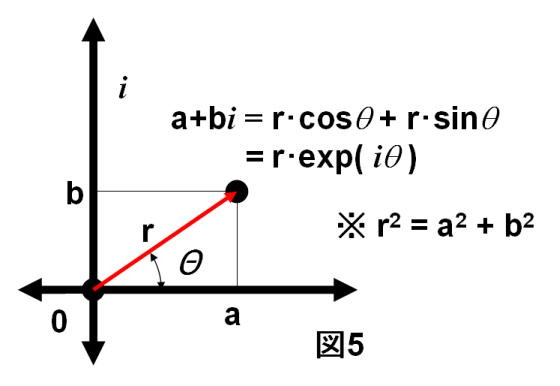

数学同好会 複素数セミナー
===

* yorisilo
* ~~2018-02-26~~ 2018-03-15

今回の複素数セミナーでは、電子回路における複素数のありがたみについて話す。
複素数というか、オイラーの公式 $e^{i\theta} = \cos \theta + i \sin \theta$ を使うことで、電子回路における所々の計算が大変やりやすくなる。
ということについて話す。

このセミナーでは以下を理解することを目指す。

* 交流回路で電圧や電流を複素数表示する理由：
交流回路って直流回路と違って、電流の向きが時間によって周期的に変化する。
で、負荷が抵抗だけだったら、大きさが変わるだけで位相は変化しないのだけど、
コンデンサとかコイルがあると、位相も変化してしまう。
で、複素平面上で考えると、位相差の計算って微分とか積分とかしなくてもできる。
複素数の足し算引き算はベクトル計算ぽいし、掛け算割り算は、位相の足し算引き算に対応してる。
だから、複素数使って電子回路の所々の計算したら楽。
ただし、角振動数が同じ場合。

https://hackmd.io/s/SyuWaNl_G この資料と同じものを hackmd にも置いた。 ただ画像とかうｐするのめんどいので画像は empty

---

# 電子回路

* 直流(DC)回路
電圧、電流の大きさが時間によって変化しない。

* 交流(AC)回路
電圧、電流の大きさが時間によって周期的に変化する。

[家庭用のコンセントはなぜ直流ではなく交流なの？](http://santa001.com/%E4%BA%A4%E6%B5%81%E3%81%A8%E7%9B%B4%E6%B5%81-210)

> 送電線の電気抵抗が1Ωとします。そして発電電圧が100V ，電流1Aで送電するとします。このときの送電線の電圧降下は1A×1Ω＝1Vです。すると送電損失は1V×1A＝1Wとなります。
> 同様の送電線で変圧器で1000V，0.1Aに変圧したとします。このときの送電線の電圧降下は0.1A×1Ω＝0.1Vです。すると電力損失は0.1V×0.1A＝0.01Wとなります。変圧しただけで1/100になりました。
https://detail.chiebukuro.yahoo.co.jp/qa/question_detail/q1466212129

* 閑話休題
電流戦争(テスラ、ウェスティングハウス(交流送電)とエジソン(直流送電)との確執)が映画になったので早く見たいですね！！
https://wired.jp/2017/10/15/the-current-war-trailer-debut/

---

# 交流

交流電圧

$$ V = V_0 \cos ( 2\pi f t + \theta)$$

交流電流

$$ I = I_0 \cos ( 2\pi f t + \phi)$$

* $V_0, I_0$ を`振幅`という。電圧、電流の最大値を表している。
* $f$ は`周波数`。1秒間に波形が繰り返す数のこと。 $t$ 秒間だと、 $ft$回。三角関数はカッコの中身が $2 \pi$増えるごとに同じ形を繰り返すから$2\pi f t$と書けば、ちょうどその通りの意味になる。
* 三角関数のカッコの中身を`位相`と呼ぶ。 $\theta, \phi$はその`位相のずれ`を表現するための定数であるが、この$\theta, \phi$だけを指して「位相」と呼んでしまうこともよくある。
* $2\pi f$ を $\omega$ と表記し、`角周波数(角振動数)`という。 $2\pi$ 秒あたりの振動数のことである。何回円を回るかを表してる。本質的には周波数と同じもの。$f = 50 Hz$ だったら、50回ぐるぐるまわる。つまり、角振動数は $2 \pi f = 100 \pi$

---

## 用語など

コイルやコンデンサは交流回路では、`電流の流れを妨げる`という抵抗の性質に加えて、`回路に流れる電流の位相を変化させる`という性質を持つ。

 このため、コイルやコンデンサの抵抗成分を純粋な抵抗と区別して取り扱う。そして、コイルやコンデンサの作る抵抗成分を`リアクタンス`と名付ける。

### インダクタ(コイル)とキャパシタ(コンデンサ)のリアクタンスの成分

* インダクタンス
リアクタンスを発生させるコイルの成分 $\omega L$ の $L$ のこと

* キャパシタンス
リアクタンスを発生させるコンデンサの成分 $\frac{1}{\omega C}$ の $C$ のこと

### 抵抗、リアクタンス、インピーダンス、(アドミタンス)

* 抵抗(レジスタンス)
電流の流れにくさを示すもの。直流でも交流でも、抵抗値が大きくなるほど電流が流れにくくなる。

* リアクタンス
交流電圧を加えたときのみ電流の流れを妨げる要素をリアクタンスという。リアクタンスを持っているものはインダクタ(コイル)やキャパシタ(コンデンサ)。

* インピーダンス
インピーダンスとは、交流電流の流れにくさを示すもの。交流電流の流れを妨げるのは抵抗とリアクタンスなので、抵抗とリアクタンスをあわせたものがインピーダンスとなる。

* アドミタンス
インピーダンスの逆数。なぜこれを考えるかというと、計算が楽になることがあるから。具体的にいうと、交流回路の並列回路の所々の計算のときに楽になる。

## コイル、コンデンサ、抵抗における電流と電圧の関係
* 電流入力に対する電圧出力の振幅と位相

| 素子                   | 出力電圧の振幅             | 電流に対する電圧の位相のズレ |
| :---                   | :---                       | :---                         |
| 抵抗                   | $V = RI$                   | 位相のズレなし               |
| インダクタ(コイル)     | $V = \omega L I$           | $\frac{\pi}{2}$ 進む         |
| キャパシタ(コンデンサ) | $V = \frac{1}{\omega C} I$ | $\frac{\pi}{2}$ 遅れる       |

* 電圧入力に対する電流出力の振幅と位相

| 素子                   | 出力電流の振幅             | 電圧に対する電流の位相のズレ |
| :---                   | :---                       | :---                         |
| 抵抗                   | $I = \frac{1}{R}I$         | 位相のズレなし               |
| インダクタ(コイル)     | $I = \frac{1}{\omega L} V$ | $\frac{\pi}{2}$ 遅れる       |
| キャパシタ(コンデンサ) | $I = \omega C V$           | $\frac{\pi}{2}$ 進む         |

### 各法則
* オームの法則 $V=RI$
* クーロンの法則 $Q=CV$
* 電流とは電荷の流れを表す量でありその大きさは電荷の時間微分に等しい $I = \frac{dQ}{dt}$

* キルヒホッフの法則
  * キルヒホッフの第1法則： 回路上の任意の点に流れ込む電流の総和と流れ出る電流の総和が等しいことである
  * キルヒホッフの第2法則： 回路上の任意の閉回路の順方向に対する起電力の総和と電圧降下の総和が等しいことである

* R 抵抗
* I 電流
* Quantity of electric charge ： 電荷（電気量）
* Capacity ： 静電容量
* Voltage ： 電圧

---

# 複素数表示
先程のこれを
$$ V = V_0 \cos (\omega t + \theta)$$

オイラーの公式
$$e^{i\theta} = \cos \theta + i \sin \theta$$

を用いて書き直すと、以下のようになる。

$$ V = V_0 e^{i(\omega t + \theta)}$$

としたが、ちょっとこれは思い切りが良すぎる気がする
実数部分は等しいが、虚数部分は余計だからである。実はこの虚数部分は無視すればよい。
我々が、実際の電圧や電流を考えるときは、実数部分にのみ着目すれば良いからである。
これを導入した理由は`微分、積分の計算が楽`になり、直流回路の計算と同じようにインピーダンスの計算ができるからである。

## 複素数表示の微分と積分

$$ \frac{d}{d t}(V_0 e^{i(\omega t + \theta)}) = i \omega V_0 e^{i(\omega t + \theta)}$$

$$ \int (V_0 e^{i(\omega t + \theta)}) dt= \frac{1}{i \omega} V_0 e^{i(\omega t + \theta)}$$

* 現実世界の時間微分は複素数表示では$i \omega$倍することに等しい！

* 現実世界の時間積分は複素数表示では$\frac{1}{i \omega}$倍することに等しい！

---

# 複素インピーダンス
交流回路における`電気の流れにくさ` を`(複素)インピーダンス`という。直流回路でいうところの抵抗。

$$Z = \frac{V}{I} = \frac{ \mid V \mid e^{i\theta}}{\mid I \mid e^{i\phi}} = \frac{V_0}{I_0} e^{i(\theta - \phi)}$$

where $V = V_0 e^{i\theta}, I = I_0 e^{i\phi}$

この 振幅 $Z_0 := \frac{V_0}{I_0} = \frac{\mid V \mid}{\mid I \mid} \in \mathbb{R}$ が我々が現実世界で観測するインピーダンスである。

> インピーダンスを複素数で書いておくとその意味が非常に明確になる。というのも、インピーダンスの大きさは交流電流と交流電圧の大きさの比なので`抵抗の大きさ`に該当し、インピーダンスが位相を持てば電流と電圧の間に位相差が生じるのである。

# コンデンサーとコイルのインピーダンスを計算してみよう
以下、交流起電力を $V = V_0e^{i\theta}$ とする。

## 複素数表示を利用してやってみる
### コンデンサー(キャパシタンス)

電流とは電荷の流れを表す量でありその大きさは電荷の時間微分に等しいので、
$I = \frac{d}{dt} Q$ である。

$Q = CV$ より、

$I = \frac{d}{dt} C V_0e^{i\theta}$

また、 現実世界の時間微分は複素数表示では$i \omega$を掛けることと等しかったので、

$I = \frac{d}{dt} C V_0e^{i\theta} = i \omega C V_0e^{i\theta}$ となる。

また、 $i = e^{i \frac{\pi}{2}}$ となるので、

$I = i \omega C V_0e^{i\theta} = e^{i\frac{\pi}{2}} \cdot \omega C V_0e^{i\theta} = \omega C V_0e^{i(\theta + \frac{\pi}{2})}$

となり、電流の位相が電圧に対して$\frac{\pi}{2}$ 進んでいることがわかる！！

ばんざい。

最後に、コンデンサのインピーダンスを $Z_C$ と書くと、

$Z_C = \frac{V}{I} = \frac{1}{i \omega C}$ となる。

コンデンサのインピーダンスの虚部 $Im[Z_C] = \frac{1}{\omega C}$ のことを容量リアクタンスと呼ぶ。

さっきの表とこっちも同じね！！

やったね。

### コイル(インダクタ)

ある時刻$t$において回路を流れている電流を$I$とすると, コイルを流れる電流の時間変化は$\frac{dI}{dt}$であり, コイルには電流の向きとは逆向きの起電力$V$が発生するので、

$V = L \frac{dI}{dt} \iff \frac{dI}{dt} = \frac{1}{L} V $

両辺を時間$t$で積分する事を考える。

$$\int \frac{dI}{dt} dt = \int \frac{1}{L} V dt \iff I = \int \frac{1}{L} V dt$$

また、 現実世界の時間積分は複素数表示では$\frac{1}{i \omega}$を掛けることと等しかったので、

$$I = \frac{1}{i \omega L} V = \frac{1}{i \omega L} V_0e^{i\theta}$$ となる。

また、 $\frac{1}{i} = e^{- i \frac{\pi}{2}}$ となるので、

$$\frac{1}{i \omega L} V_0e^{i\theta} = \frac{1}{\omega L} V_0e^{i(\theta - \frac{\pi}{2})}$$

となり、電流の位相が電圧に対して$\frac{\pi}{2}$だけ遅れていることがわかる！！！

ばんざい。

最後に、コイルのインピーダンスを $Z_L$ と書くと、

$Z_L = \frac{V}{I} = i \omega L$ となる。

コイルのインピーダンスの虚部 $Im[Z_L] = \omega L$ のことを誘導リアクタンスと呼ぶ。

さっきの表とこっちも同じね！！

やったね。

<!-- コイルとコンデンサの計算結果がちゃんと予期したものと一致してるかの確認をする -->

---

# 合成インピーダンスの計算

## まずは三角関数でふつうにやってみる
$V = V_0 \cos{\omega t + \theta_0}$ とする。

$$ V + V_L = V_C + V_R - (1)$$
$$ V_0 \cos(\omega t + \theta_0) -L\frac{d}{dt} I = RI + \frac{Q}{C}$$
$I = I_0 \cos(\omega t + \phi)$ として、(1) に代入すると、...

三角関数の合成とか使って、計算をしていくわけです。面倒です。

<!-- 三角関数の合成とかを考えてうんちゃら計算するのめんどいーってのを見せる -->

## 複素数表示を利用してやってみる。
直流回路の時に合成抵抗を求めた方法と同じ方法をインピーダンスに適用することでその回路の合成インピーダンスを知ることが出来るのがミソ

回路に流れる電流を $I$ とすると、

$V = Z_R I + Z_L I + Z_C I$
$V = (Z_R + Z_L + Z_C) I$

なので、 合成インピーダンス $Z := (Z_R + Z_L + Z_C)$ の大きさ $\mid Z \mid$は

$$
\begin{align}
\mid Z \mid &= \mid Z_R + Z_L + Z_C \mid \\\
&= \mid R + i \omega L + \frac{1}{i \omega C} \mid \\\
&= \mid R + i (\omega L - \frac{1}{ \omega C}) \mid \\\
&= \sqrt{R^{2} + i (\omega L - \frac{1}{\omega C})^{2}}
\end{align}
$$

簡単！！！！
<!-- 複素数で計算するの楽ーっていうのを見せる -->

# まとめ

* オイラーの公式 いいね :+1:

---

# 図形的直感

## 複素数の四則演算の意味

### 複素数の加減について

実数部と虚数部を足したり、引いたりすれば良い。
ベクトル計算と同じような特徴を持つ。

### 複素数の剰余について

$r_1 e^{i \theta_1} \times r_2 e^{i \theta_2} = r_1 \cdot r_2 e^{i(\theta_1 + \theta_2)}$

$r_1 e^{i \theta_1} \div r_2 e^{i \theta_2} = \frac{r_1}{r_2} e^{i(\theta_1 - \theta_2)}$

となり、剰余がそれぞれ位相の足し算引き算とに対応していることがわかる。

極座標的な考えによれば、ベクトルの長さが変化し、なす角も変化するということを示している。実数だけを取り扱っていたときには、われわれは $e^{i\theta} = 1$（なぜなら$\theta = 0$だから）のケースだけを想定していたわけだが、複素数の場合には乗法の概念は拡張されて、「なす角$\theta$の回転」という操作が加わることが分かる。

# 参考文献
* https://physnotes.jp/em/ac/
* https://physnotes.jp/em/ac_complex/
* http://denkinyumon.web.fc2.com/denkinokiso/teikou_inpi-dansu_riakutansu.html
* https://hegtel.com/admittance.html
* [実効値について](http://wakariyasui.sakura.ne.jp/p/elec/kouryuu/jikkouti.html)
$\text{実効値} = \frac{\text{最大値}}{\sqrt{2}}$
* http://eman-physics.net/circuit/ac.html
* https://mmnakayama.jimdo.com/study/%E8%A4%87%E7%B4%A0%E6%95%B0/
* http://www.kairo-nyumon.com/electric_circuits.html
