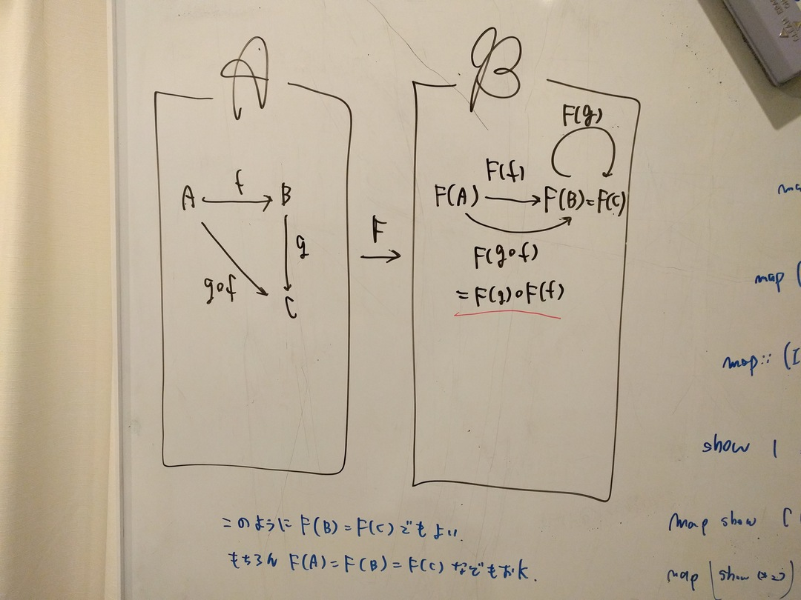
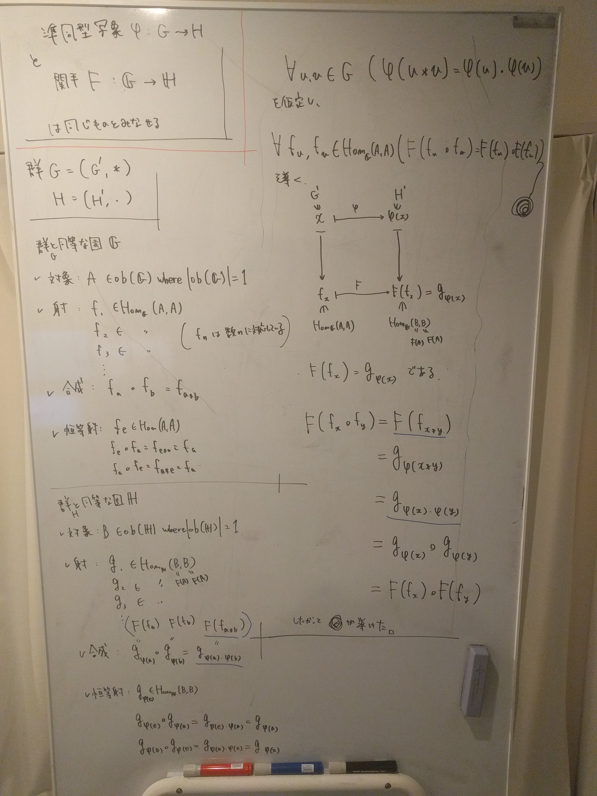

slidenumbers: true
footer: ベーシック圏論輪読会 第３回
autoscale: true
build-lists: true
theme: Franziska, 1

$$\require{AMScd}$$

# ベーシック圏論輪読会 第３回
# 1.2 関手 p20-26
# yorisilo


---
# 今日覚えて帰ってほしい事柄
* 関手のイメージ
* 関手の定義
* 関手の例
* 忘却関手のイメージ
* 圏 Hask における関手

---

# 圏の間にも成り立つ射

---

# 圏の間にも成り立つ射
# [fit] 関手！

---

# 関手

関手とは、圏から圏への射のことです。
関手とは、圏から圏への構造を保つマッピングのことです。
構造を保つマッピング？

圏の構造

* 対象
* 始域、終域を備えた射
* 射の合成
* 恒等射
(結合則、単位則)

<!-- $$ -->
<!-- \begin{CD} -->
<!--     F(B) @>F(f)>> F(A) \\ -->
<!--     @VbVV @VaVV \\ -->
<!--     B @>f>> A -->
<!-- \end{CD} -->
<!-- $$ -->

---

### [fit] 関手のイメージ

---

## 圏 $$\mathscr{A}$$ から圏 $$\mathscr{B}$$ への関手 $$F:\mathscr{A} \to \mathscr{B}$$ とは、

---

## 圏 $$\mathscr{A}$$ のすべての対象を 圏 $$\mathscr{B}$$ のある対象に移し、


---

## 始域、終域を保って $$\mathscr{A}$$ のすべての射を$$\mathscr{B}$$ のある射に移し、


---

## 射の合成と、



---

## 恒等射を保つものである。


---

### [fit] 関手のふわっとした例

---

## 関手の例1


---

## 関手の例1


---

## 関手の例1


---

## 関手の例2


---

## 関手の例2


---

## 関手の例2


---

## 関手の例3 kwsk


---

## 関手の例3 kwsk


図中の訂正 $$F(g \circ f) \neq F(f)$$ であるので注意。
それぞれに矢印が必要

---

## 関手の例4 kwsk


---

## 関手の例4 kwsk


---

## 関手の例4 kwsk


---

### [fit] 関手の定義

---

# 関手の定義

* $$\text{関手 } F: \mathscr{A} \to \mathscr{B}$$とは

$$
\begin{eqnarray}
\forall A \in ob(\mathscr{A}) に対して、A \mapsto F(A) &;& ob(\mathscr{A}) &\to& ob(\mathscr{B}) \\
\forall f \in 圏 \mathscr{A}の射の集合 に対して、f \mapsto F(f) &;& \mathscr{A}(A, A') &\to& \mathscr{B}(F(A), F(A')) \\
\end{eqnarray}
$$

という関数の組であり、以下の公理を満たすもの[^c]

$$
\begin{eqnarray}
\
\forall f \in \mathscr{A}(A, A'),\, g \in \mathscr{A}(A', A'') &&に対して、F(g \circ_1 f) &=& F(g) \circ_2 F(f) \\
\forall A \in ob(\mathscr{A}) &&に対して、F(1_{A}) &=& 1_{F(A)}
\end{eqnarray}
$$

[^c]: $$\circ_1$$、$$\circ_2$$ とに分けた理由は、移す前の圏の合成と移した先の圏の合成とは同じものとは限らないので、このように分けてる。 準同型写像に見えてくる

---

# 関手の定義
重要なのは、

$$\text{関手 } F: \mathscr{A} \to \mathscr{B}$$ を考える時

* 圏 $$\mathscr{A}$$ のすべての対象に対して、圏 $$\mathscr{B}$$ のある__対象への対応__がある
* 圏 $$\mathscr{A}$$ のすべての射に対して、圏 $$\mathscr{B}$$ の(始域と終域を保った)ある__射への対応__がある

ということ

* 関手は真に__関数__なのです

---

### [fit] 関手の具体例

---

# 関手の例
関手$$F: \mathscr{A} \to \mathscr{B}$$

圏 $$\mathscr{A}$$
* 対象 (有限)集合
* 射 包含関係 $$\subseteq$$

圏 $$\mathscr{B}$$
* 対象 自然数
* 射 全順序関係 $$\leq$$

* $$\mathscr{A}$$の対象である集合の濃度を$$\mathscr{B}$$の自然数に対応させ、包含関係を全順序関係に対応させる
$$\mathscr{A} $$ はこんなかんじ $$\{0,1\} \to \{0,1,2\} \to \{0,8,9,10\} $$
$$\mathscr{B}$$ はこんなかんじ $$0 \to 1 \to 2 \to 3 \to 4 \to 5 \to ...$$

---

# 忘却関手[^U]の例
$$U : \mathbf{Grp} \to \mathbf{Set}$$

* 群の構造とか、演算とか忘れて、群の台集合だけを取り出す関手

[^U]: 忘却関手という用語は非公式な用語であり、明確な定義はない。あえていうなら、domain で持っていた構造/性質を co-domain では忘却してしまっている関手というニュアンス

---

# [fit] 何言ってんだこいつ

---

# $$\mathbf{Grp}$$: 群と準同型写像の圏
* 対象: 群
* 射: 準同型写像[^1]
* 合成: 準同型写像の合成
* 恒等射: 恒等写像

[^1]: $$群 (G, *), (H, \cdot)$$ について $$f:G\to H$$ が準同型写像 $$\Leftrightarrow$$ $$\forall u, v \in G (f(u*v)=f(u)\cdot f(v))$$

---

# $$\mathbf{Set}$$: 集合と写像の圏
* 対象: 集合
* 射: 写像(関数)
* 合成: 関数合成
* 恒等射: 恒等写像

---

## $$U: \mathbf{Grp} \to \mathbf{Set}$$ が忘却関手になるイメージ
たとえばこんなかんじ

* $$\mathbf{Grp}$$
対象 $$(G, *), (H, \cdot) \in Obj(\mathbf{Grp})$$
射 $$f: G \to H で、\forall u, v \in \mathbb{G} \, (f(u*v)=f(u) \cdot f(v)) \in \mathbf{Grp}(G,H)$$
[^t]

* $$\mathbf{Set}$$
対象 $$U(G) = G,\, U(H) = H \in Obj(\mathbf{Set})$$
射 $$U(f): G \to H \in \mathbf{Set}(U(G), U(H))$$

* $$U$$ によって $$\mathbf{Grp}$$ の 対象 $$G$$ の演算が忘却され、射 $$f$$ の準同型写像が忘却され写像になっていることがわかる。

[^t]: 対象から対象への射になってないのだが、いいのだろうか :astonished:

---

# 自由関手[^F]の例
$$F: \mathbf{Set} \to \mathbf{Grp}$$

* $$\mathbf{Set}$$ の対象である集合にその集合の要素を生成する自由群に対応させるもの
* 集合間の写像を自由群間の準同型写像に対応させる関手

[^F]: 自由関手という用語は非公式な用語であり、明確な定義はない。忘却関手と双対であるような関手である。忘却関手の左随伴を、普通は"自由"関手と呼ぶ。随伴関手の説明はしません(できません) :no_good: 関手における逆射みたいなやつ？

---

# [fit] 何言ってんだこいつパート2

---

# 自由群
...

自由モノイドに 逆元を導入したもの
（逆元の導入がちょっと面倒）

---

# 自由モノイド[^fr]
文字集合 $$\Sigma$$ 上の有限文字列全体(空文字を含む) と 文字の連結 $$\cdot$$ の組を自由モノイドと呼ぶ

* 例でなんとなく把握しよう($$a$$ は文字 $$'a'$$ と思ってください)
文字集合 $$ \Sigma = \{'', a, b, c\}$$
$$\Sigma$$ 上の有限文字列全体(空文字含む): $$\{'', a, b, c, ab, bc, ...\}$$
文字の連結を表す二項演算 $$\cdot$$
結合法則 $$(a \cdot b) \cdot c = a \cdot (b \cdot c)$$
単位元の存在 $$''$$


[^fr]: 自由モノイドの「自由」の意味：二項演算が文字列の連結であるだけなので、2 * 3 = 6 というようなルールがない。文字の並べ替えの規則以外の規則が全くない（意味論がなく、統語論だけで話がすむ）からのよう。

---

# 自由群 再び

自由群の普遍性
任意の群 $$G$$ に対し $$g : F(X) \to G$$ という準同型写像があるとき、$$g$$ の $$X$$ への制限写像(定義域を制限する)について、任意の $$f : X \to G$$ というXから群Gの台集合 $$G$$ への関数について、任意の $$a \in X$$ について $$g(a) = f(a)$$ となるものがただひとつ存在する

---

# てことで、
集合間の写像 $$f: S \to S'$$ は 群準同型写像 $$F(f): F(S) \to F(S')$$ を誘導する。

$$f: \{a,b,c\} \to \{u,v\} , f(a) = f(b) = u, f(c) = v$$ のとき、これは
準同型写像 $$F(f) : F(\{a,b,c\} \to F(\{u,v\}))$$ を誘導し、

$$a^{-4}b^{3}a^{3}c^{-6} \in F(\{a,b,c\})$$ は
$$u^{-4}u^{3}u^{3}v^{-6} \in F(\{u,v\})$$ へと写される

---

# 圏 Hask
* 対象 型
* 射 関数
* 射の合成 (.)
* 恒等射 id [^a]

結合則、単位則は以下のように満たしてる

* 関数の合成はもちろん関数になってる
* $$(f . g) . h = f . (g . h)$$
* $$id . f = f . id = f$$

[^a]: haskell のid 関数は多相で、圏論の恒等射は単相なので、ちゃんと対応させようとすると $$(id :: B \to B) . f = f . (id :: A \to A) = f$$ みたいに型を明示することによって単相化(単相型によるインスタンス化)させて書く必要がある

---

# 圏 Hask の関手 Functor
Functor ($$\mathbf{Hask} \to \mathbf{Hask}$$)
関手は
* 圏$$\mathscr{A}$$の対象を圏$$\mathscr{B}$$の対象に対応付け、
* 圏$$\mathscr{A}$$の射を圏$$\mathscr{B}$$の射に対応付ける。

以下の Functor も 上記を満たしてる

``` haskell
class Functor (f :: * -> *) where
  fmap :: (a -> b) -> (f a -> f b)
```
* 小文字の $$f$$ が 関手を表してる
* `(f :: * -> *)` 型を受け取って型を返す(対象から対象への対応)
* `fmap :: (a -> b) -> (f a -> f b)` 関数 `a -> b` を受け取って、 `f a -> f b` を返す (関数から関数への対応)

---

# Maybe関手

``` haskell
instance Functor Maybe where
  fmap f (Just x) = Just (f x)
  fmap _ Nothing  = Nothing
```

* Maybe は任意の型 T をとり新たな型Maybe Tとなる。
* fmap は関数 $$a \to b$$ を受け取り、関数 $$\mathbf{Maybe}\,\, a \to \mathbf{Maybe}\,\, b$$ を返す。

* Maybe は Hask圏の対象(型)を受け取り、Maybe圏 [^m]の対象を返す。
* fmap は Hask圏の射(関数)を受け取り、 Maybe圏 [^m]の射を返す。

[^m]: Maybe型を対象、Maybe型上の関数を射とする圏

---

# [fit] Functor は 関手の公理は満たしているか確認してみよう

``` haskell
fmap id = id
```

``` haskell
fmap (f . g) = fmap f . fmap g
```

---

# Maybe関手のわかりやすい図


[^mimg]

[^mimg]: via http://bitterharvest.hatenablog.com/entry/2017/02/25/113855

---

# 参考文献
[Functor(関手)ってなんですか？](http://south37.hatenablog.com/entry/2014/03/25/Functor%E3%81%A3%E3%81%A6%E3%81%AA%E3%82%93%E3%81%A7%E3%81%99%E3%81%8B%EF%BC%9F)
[Haskell/圏論](https://ja.wikibooks.org/wiki/Haskell/%E5%9C%8F%E8%AB%96)
[圏論勉強会 第1回](https://youtu.be/uWST7UivqeM)
[同型と準同型](http://proofcafe.org/k27c8/math/math/group/page/isomorphism_and_homomorphism/)
[群の準同型定理](http://rikei-index.blue.coocan.jp/daisu/zyundoukei.html)
[忘却関手のイメージ](http://tnomura9.exblog.jp/21059078/)
[圏論勉強会用語集(1-3回まで)](http://d.hatena.ne.jp/a-hisame/20130605/1370446860)
[像と核](http://senkei.nomaki.jp/kernel_image.html)

---

# [fit] メモ

---

# 定義域⊆始域 と 値域⊆終域

左の等号が成り立たないのは部分写像のときで、
右の等号が成り立つのは全射のとき。
終域は他にも、終集合、補域、余域、余定義域（コドメイン）と呼ばれている。

ちなみに「双射」は「全単射」である。

---

# $$\mapsto$$ と $$\to$$

記号 | 意味 | 説明
---|---|---
$$f : X \to Y $$ | 写像	| f が X から Y への写像であることを示す
$${\displaystyle x {\stackrel  {f}{\mapsto }} y}$$ | 元の対応 | x を写像 f によって写したものが y であることを意味する

<!-- $$ -->
<!-- \begin{array}{ccc} -->
<!-- X                     & \longrightarrow & Y \\ -->
<!-- x                     & {\stackrel  {f}{\mapsto }}     & y -->
<!-- \end{array} -->
<!-- $$ -->

---

# 台集合
空でない集合 $$A$$ と二項演算 $$\cdot: A \times A \to A$$ の組 $$(A,\, \cdot)$$ を 台集合 $$A$$ を持つ代数系という。

---

# 群準同型 群同型
* __準同型写像__の定義
群 $$(G, *), (H, \cdot)$$
写像 $$f: G \to H$$
について、$$f$$ が準同型写像とは以下を満たすものである。
$$\forall x,y \in G \, (f(x * y) = f(x) \cdot f(y))$$

意味を完全に捨てて、ただ「構造」だけに着目すると、２つの群は全く同じ振る舞いをする。

* __同型写像__の定義
$$f$$ が準同型写像 かつ $$f$$ が全単射 のとき $$f$$ を同型写像と呼ぶ

---

#### 群準同型写像と関手が<br>同じものとみなせる



---

# [fit] 群と圏ってかなり相性いいのでは

群自体を表す圏は

* 対象 Aのみ
* 射 $$f_x:A \to A$$ の射がそれぞれ、群の台集合の元 $$x$$ に対応
* 合成 群の二項演算に対応

---

# [fit] 集合自体を表す圏は作れるの？？
集合自体を表す圏は

* 対象 Aのみ
* 射 $$f_x:A \to A$$ の射がそれぞれ、集合の元 $$x$$ に対応
* 合成 ... これはどうやって作れば良いのだ。。

---

# 忘却関手と自由関手

随伴というもの知ってるとわかり良いかもしれない

* 忘却関手 $$U: \mathbf{Grp} \to \mathbf{Set}$$
* 自由関手 $$F: \mathbf{Set} \to \mathbf{Grp}$$
と、逆射のように見えるが、（ある種、逆射的な感じなのだが、）ちと違う。

忘却関手の方の $$\mathbf{Grp}$$ は、群の圏であり、
自由関手の方の $$\mathbf{Grp}$$ は、自由群の圏である。

行って戻ってきたら、ちょっと違うやつが帰ってきた的な。

<!-- # 可換図式の書き方 -->
<!-- $$\require{AMScd}$$ -->

<!-- $$ -->
<!-- \begin{CD} -->
<!-- A @>f>> B \\ -->
<!-- @VFVV @VFVV \\ -->
<!-- F(A) @>F(f)>> F(B)  -->
<!-- \end{CD} -->
<!-- $$ -->
