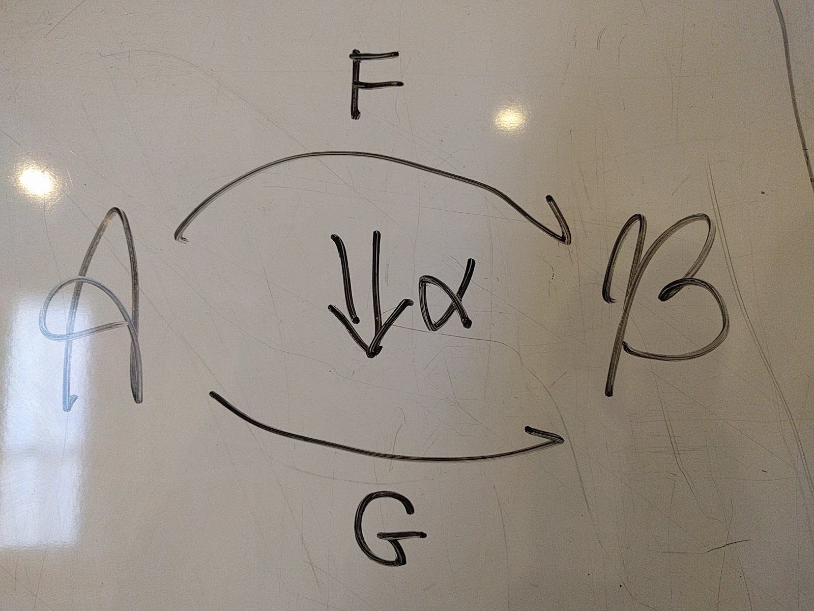
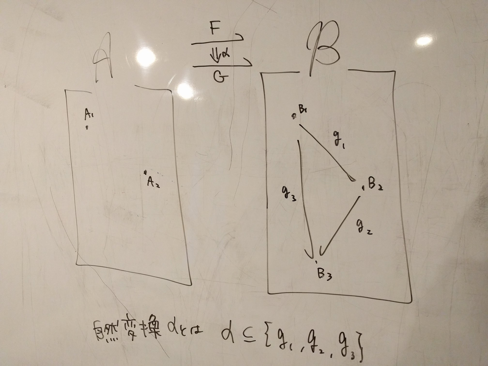
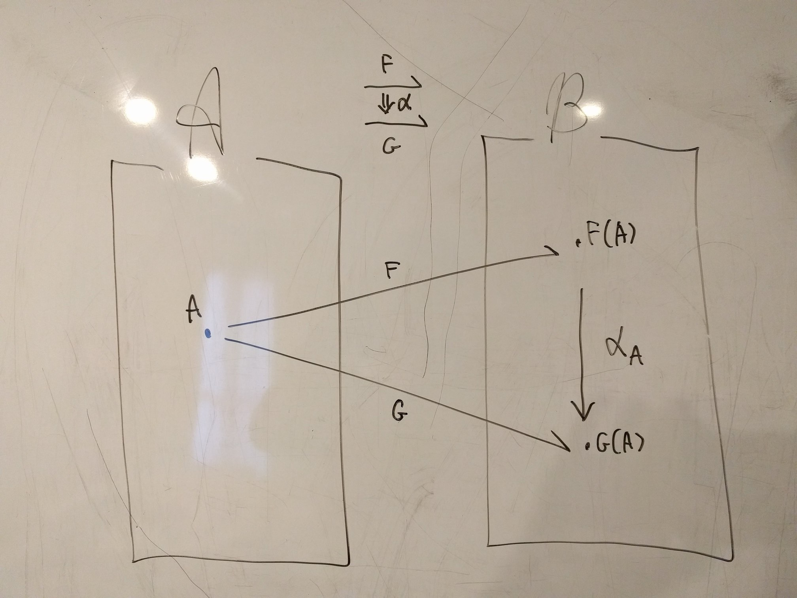
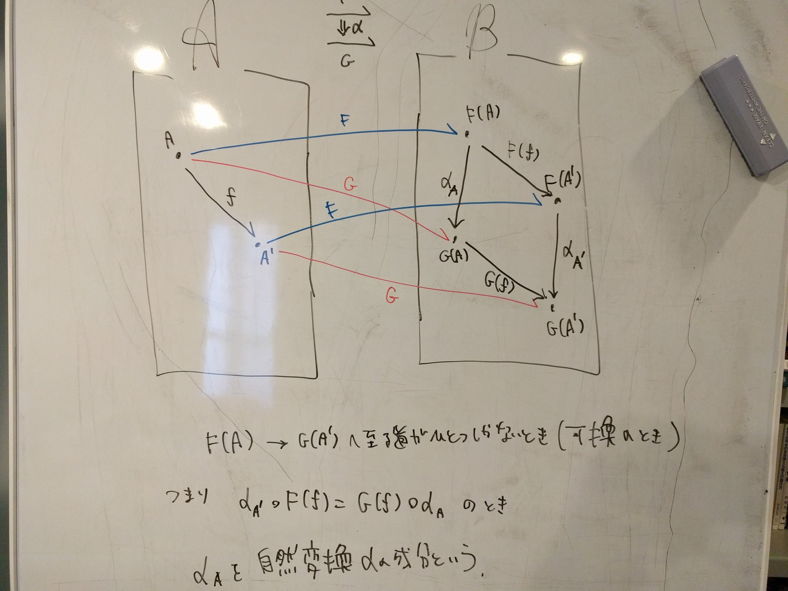
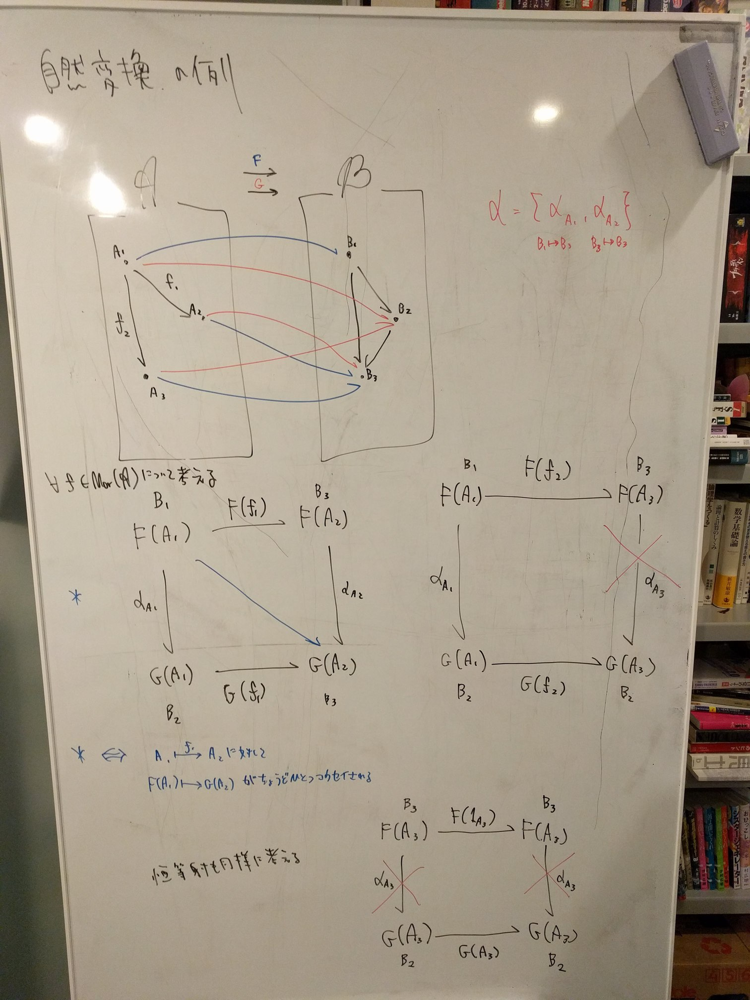
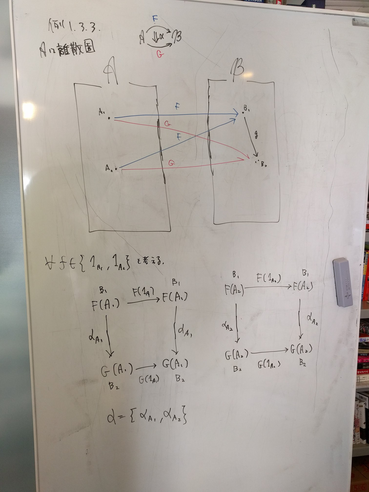
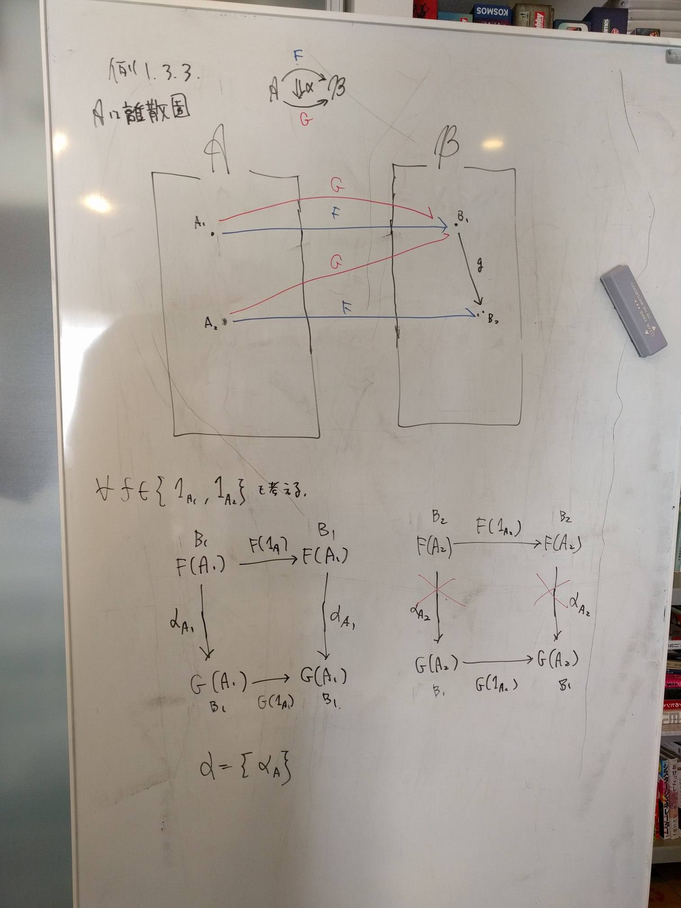
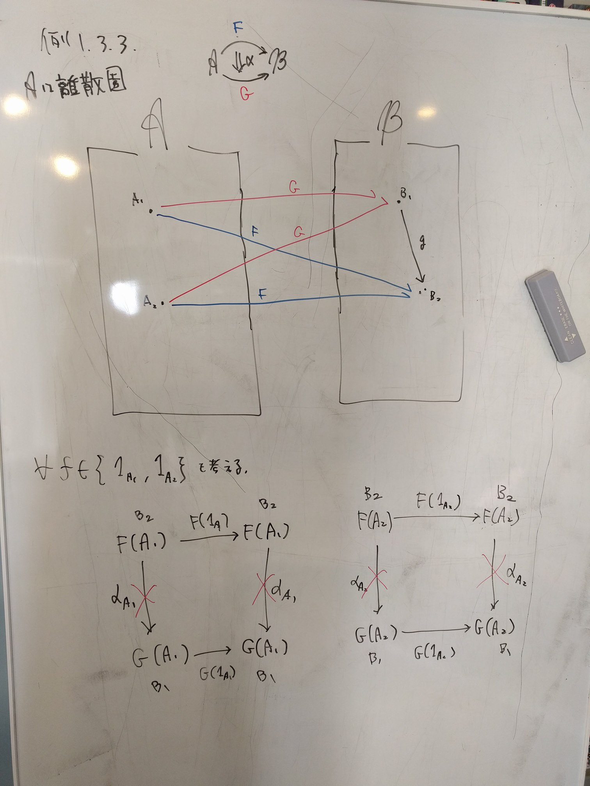
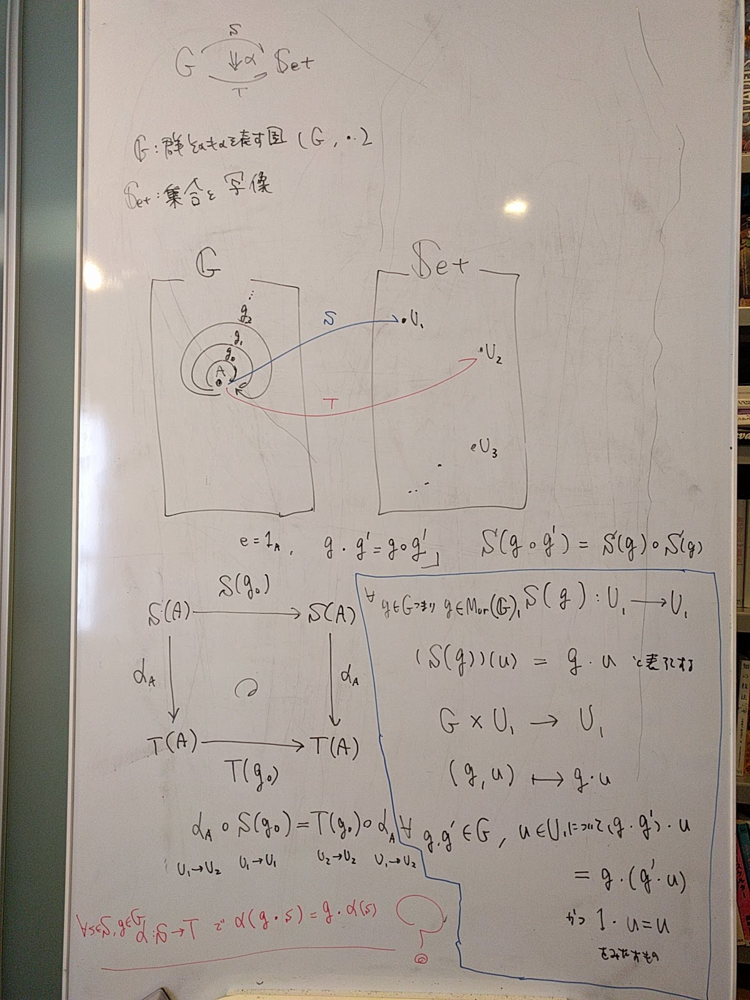

slidenumbers: true
footer: ベーシック圏論輪読会 第６回
autoscale: true
build-lists: true
theme: Franziska, 1

$$\require{AMScd}$$

# ベーシック圏論輪読会 第６回
# 1.3 自然変換 p32-35
# yorisilo

---

# 今日覚えて帰ってほしい事柄
* 自然変換はこわくない
* 自然変換のイメージ
* 自然変換の定義
* 自然変換の例 (**山場**)

---

# 自然変換とは

---

# 関手の間の射っぽいやつ

ただし、 圏の射の射の族は考えない。(とりあえず無視してくれ)

---

# (圏の間の射 = 関手)の射っぽいやつ

---

# [fit] 圏論は `射` が命

---

# 自然変換はこわくない

自然変換とは、関手の値域の射の一部

あ、恒等射を入れるの忘れてた。正確には、 $$\alpha \subseteq \{g_1, g_2, g_3, 1_{g_1}, 1_{g_2}, 1_{g_3}\}$$。
$$ob(\mathscr{A})$$ をインデックスとした射の族 $$\alpha_{A_1}, \alpha_{A_2}$$ が $$\{g_1, g_2, g_3, 1_{g_1}, 1_{g_2}, 1_{g_3}\}$$ に含まれていれば、それらは自然変換の条件を満たしているので、 $$\alpha$$ は自然変換である。

---

# [fit]自然変換のイメージ

---

# 自然変換のイメージ

---

# 自然変換のイメージ

---

# 自然変換の定義
関手 $$ F,G: \mathscr{A} \to \mathscr{B} $$とする。
自然変換 $$\alpha : F \to G$$ とは、

* $$ \alpha = \{ \alpha_x \in Mor(\mathscr{B}) \mid x \in ob(\mathscr{A}) \}$$ という $$\mathscr{B}$$ の射の族[^1][^2]であり

* $$ \forall f \in Mor(\mathscr{A}) $$ について、可換になるもの ($$ \alpha_{A'} \circ F(f) = G(f) \circ \alpha_{A} $$)

$$
\require{AMScd}
\begin{CD}
F(A) @>F(f)>> F(A') \\
@V\alpha_{A}VV         @VV\alpha_{A'}V \\
G(A) @>>G(f)> G(A')
\end{CD}
$$

[^1]: $$(F(A) {\stackrel {\alpha_A}{\mapsto }} G(A))_{A \in ob(\mathscr{A})}$$ と同意

[^2]: $$F(f) {\stackrel {\alpha_{f}}{\mapsto }} G(f)$$ みたいなものは考えない。(関手の codomain の射の射の族は考えない)

---

#### 自然変換の例

---

#### 自然変換の例  A が離散圏の場合その1

---

#### 自然変換の例  A が離散圏の場合その2

---

#### 自然変換の例  A が離散圏の場合その3

---

#### 自然変換の例  群とSetのやつ

---

# [fit]自然変換 やっぱりこわい :scream:

---

# 参考文献
[自然変換 via bitterharvest’s diary](http://bitterharvest.hatenablog.com/entry/2017/06/07/210510)
[ベーシック圏論 - 圏・関手・自然変換 via cympfh.cc](http://cympfh.cc/aiura/basic-cat-01.html)

---

# [fit] memo

---

# 作用について

* $$T \times S \to S$$ の形の写像を、$$T$$ の $$S$$ への 左作用という。
* $$S \times T \to S$$ の形の写像を、$$T$$ の $$S$$ への 右作用という。

---

# 関手の定義

* 定義域の対象すべてを移す
* 定義域の射すべてを移す

関手則
$$
\begin{eqnarray}
\require{AMScd}
\\
A {\stackrel {f}{\mapsto }} A' {\stackrel  {f}{\mapsto }} A'' であるような \forall f \in \mathscr{A}(A, A'),\, g \in \mathscr{A}(A', A'') &&に対して、F(g \circ f) &=& F(g) \circ F(f) \\
\forall A \in ob(\mathscr{A}) &&に対して、F(1_{A}) &=& 1_{F(A)}
\end{eqnarray}
$$
