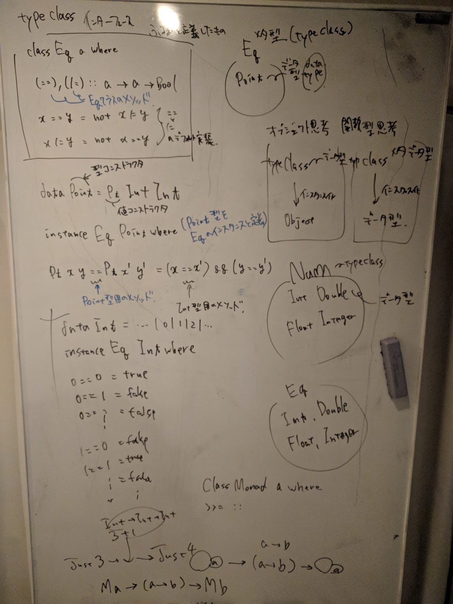

2018-07-06 13:08:46

# How to deal side effects with haskell

haskell で副作用をどのように扱っているかについて

yorisilo

# 話すこと
30分位で話す予定

関数型言語 特に haskell についての話をする。

この発表を聞けば

- 関数型言語(haskell) ってどんなもの？
- haskell には副作用が無いっていうけど実際どういうこと？

という疑問にざっくりと答えられるようになります。

# 目次：

- 関数型言語にまつわる神話
- 関数型言語とは
- 参照透過性と副作用について
- 明示的に副作用を扱うとは
- IO モナド

- Appendix:
- ファンクター アプリカティブファンクター モナド
[データ型と型クラスの違い - ushumpei’s blog](https://ushumpei.hatenablog.com/entry/2016/05/31/012939)
- Maybe モナド IO モナド
- 型クラスにまつわること

# 関数型言語にまつわる神話
> 関数型プログラミングとは膨大な概念が漠然と集まったものであるのにもかかわらず、ごく一部の要素だけに注目して関数型プログラミングあるいは関数型プログラミング言語を定義付けようとするものもあります。たとえば、「関数型プログラミングは、mapやreduceなどの高階関数を使うプログラミングだ」とか、「関数型プログラミングとは純粋な関数によるプログラミングを支援するものだ」とかで、そのような歯切れのいい定義や説明は『わかりやすい』と受け取られることが多いらしいです。確かにそうやって関数型プログラミングをすっきりと説明できたらどんなに説明が楽だろうかと筆者も思うのですが、そういう歯切れのいい説明は関数型プログラミングをあまりに一面的にしか捉えていません
* [関数型言語のウソとホント - ちょっと小さいのはたしかですが。](http://aratama.github.io/blog/26a813ab2b188ca39019/)

ひとからげに関数型言語といっても一言で表すのは難しい。
この発表では主に haskell のことについて話していく。特に副作用をどのように扱っているかについて。

# 関数型言語とは
以下を読めばオブジェクト指向との比較がふわっとわかる。
* [関数型つまみ食い: 関数型プログラミングの何が嬉しいのか？ – ゆびてく](https://ubiteku.oinker.me/2017/05/08/purpose-of-functional-programming/)
* [オブジェクト指向 v.s. 関数型プログラミング](https://anond.hatelabo.jp/20140409010816)

* 汎用的な部品(抽象化) の存在 (ファンクター、アプリカティブファンクター、モナド etc...)
* 安全性の保証(型安全)
* 純粋な関数(参照透過な関数)を組み合わせることにより、バグが生まれにくい
* (副作用を安全に扱うための機構(モナド)がある) 特に haskell

- 並列実行がしやすい


## 関数型言語では基本的になんでも関数で表す。
> 関数型が一線を画しているのは、その「なんでも関数」というコンセプトが従来の言語よりはるかに徹底しているということです。この考え方の背景にはラムダ計算という計算モデルがあります。

ラムダ計算とは
変数、関数、関数適用 の3つだけの BNF で表される計算モデル。

```
data Expr = Var Id -- 変数
          | Lam Id Expr -- 関数(ラムダ抽象)
          | App Expr Expr -- 関数適用
```

そのラムダ計算だけで、あらゆる計算を表すことができる(チューリング完全)
データも操作もすべてその3つの組み合わせで表すことができる。ラムダ計算では 数 `0, 1, 2, ...` や `true` などのデータもその３つで表せる。 [すごいラムダ計算楽しく学ぼう](https://kimiyuki.net/blog/2014/04/05/lambda-calculus-for-great-good/)
基本的に関数型言語においてはラムダ計算という計算モデルが背景にはある。

> しかしながら、現実的には本当にすべて関数にしてしまうとプログラムのソースコードは何がなんだかわからないものになってしまいます。これは「すべて関数」というコンセプトを本当にプログラミング言語として実現したLazyKなどの言語のソースコードを眺めればすぐわかります(厳密にはLazyKはSKIコンビネータ計算というまた別の計算モデルに基づいていますが、「すべてが関数」というのはラムダ計算とも共通しています)。とてもじゃありませんが、これを読むのも書くのも不可能に近いです。しかも、現在のコンピュータではそのような計算モデルは効率が悪いという理由もあります。

> 「いろいろなものが関数」というコンセプトはHaskellのような関数型では相当に徹底されています。この意味で、筆者はHaskellのような関数型言語の言語仕様は比較的単純だと思っています（ただし、単純なのは言語仕様であって、ライブラリではその単純なモノを組み合わせてとんでもなく複雑なモノを創りだしてしまうので、その意味では関数型言語は複雑だと思います）。もちろん、ラムダ計算ほど「すべてが関数」というわけではなくて、0やTrueなどのデータは関数ではありませんし、case式やlet式のような関数でない式もたくさんあります。

## JavaScriptでは関数でないのに、Haskellでは関数であるというものの例
> JavaScriptのプロパティアクセスでは、オブジェクトpersonのnameプロパティの参照は、ドット演算子を使ってperson.nameというような構文になります。Haskellでは直積型のデータpersonからフィールドnameの値を取り出すには、フォールドラベルによって自動的に定義された関数nameを使い、name personという式になります。この式ではnameという関数を式personに適用しています。JavaScriptの.nameというプロパティアクセスは関数適用ではありませんが、Haskellのnameは関数であり、フィールドへの参照は関数適用そのものです。

> JavaScriptではfor文がありますが、Haskellにはそのような制御文は存在せず、それに相当するものがあるとしたらmapやfoldlあるいはモナドと組み合わせて使うtraverse、forMといった関数です。JavaScriptのfor文はもちろん関数ではありませんが、Haskellのこれらの関数はユーザが一から自分で定義することすら可能な、本当にただの関数です。

# 遅延評価の利点と欠点
* 利点
  - 不要な計算を減らせる
  - 無限リストが扱える
  - 大抵のことはリスト処理でできる

* 欠点
  - 評価順序がわかりづらい
  - スタックトレースが意味をなさないためデバッグしにくい

# 参照透過性と副作用について
いろいろとあって、
* [FAQ Haskellには副作用があるのか、ないのか - Togetter](https://togetter.com/li/26809)
* [参照透過性と副作用についての提言 - Qiita](https://qiita.com/sasanquaneuf/items/3df1001a027e868e9e0e)
* [DanoMoi と Haskell 副作用について d.y.d.](http://www.kmonos.net/wlog/65.html#_1549060908)

こういう話とかあるがここでは深くは立ち入らない。深淵はすぐそこにあり、一度覗くと帰ってこれなくなるかもしれないので注意してほしい。

基本的に haskell で扱うことのできるものは参照透過なものだけである。

## 参照透過性(参照透明性)
- 式の値が引数によって一意に決まること
  - 同じ式はどのタイミングで評価しても同じ値になる

参照透過な関数とは、

* 同じ入力に対しては同じ出力を返す
* 関数の呼び出しの前後で、その関数が引き起こした観測できる変化(`副作用`)がない
* どのタイミングで実行しても上記の性質を保つ

### 参照透過性を崩すもの
例えば、
* 乱数について

乱数のように評価のたびに異なる値を返す関数は haskell では定義できない。のだが、
乱数を出力するプログラムを生成することができる。
表向きは乱数を表示させているように見えるが、実際は乱数発生器を生成させているだけである。
そこらへんの話は以下を参照されたい。

* [Haskell アクション 超入門 - Qiita](https://qiita.com/7shi/items/85afd7bbd5d6c4115ad6)
* [Haskell の乱数に関する実験 - 言語ゲーム](http://d.hatena.ne.jp/propella/20051027/p2)

深淵を覗き込むことになるので注意してほしい。

## 副作用って何
一般には、プログラミング言語は式を評価する際に式の値を確定させるだけではなく、その他の処理も行う。
- 副作用とは、`その他の処理` のこと

(便宜上、副作用のことを参照透過性を破壊するものと定義することがあるが、それはあくまで便宜上なので注意)
(対象のスコープを haskell という言語に限って言えば、haskell には副作用もないし、参照透過性をやぶるものを定義することはできないらしいが、詳しく知ろうとすると深淵を覗き見ることになるので注意してほしい)

じゃあ、具体的に副作用ってなんなのさ。
`状態` と `入出力` である。

ここで頭に置いてほしいのは、副作用というものを明示的に扱う方法が haskell には用意されているということである。

# 明示的に副作用を扱うとは
* [Haskellと副作用 - あどけない話](http://d.hatena.ne.jp/kazu-yamamoto/20091214/1260774669)
* [Haskell アクション 超入門 - Qiita](https://qiita.com/7shi/items/85afd7bbd5d6c4115ad6)
* [Haskell の IO モナドと参照透過性の秘密 - TIM Labs](http://labs.timedia.co.jp/2017/08/haskell-io-monad.html)

haskell では、 乱数に限らず、時刻取得やファイル読み込みなど、結果が変化する可能性があるものはすべてアクションというものを使う。その中で今回は 入出力 のために用意された `IO` について取り上げる。

# モナド (特にIOモナドについて)
モナド (monad) は、入出力などの副作用のある処理を Haskell でうまく実現するために導入された概念。

* （参照透過性はそのままで）副作用のある処理を行う
* （遅延評価はそのままで）処理を逐次的に実行する

``` haskell
class Monad m where
  (>>=)  :: m a -> (a -> m b) -> m b
  return :: a -> m a
  ...
```

モナド則：群から逆元を取ったもの

``` haskell
交換律: return x >>= f = f x
単位律: m >>= return = m
結合律: (m >>= f) >>= g = m >>= (\x -> f x >>= g)
```

## モナドを使った具体例

``` haskell
getLine :: IO String
```
getLine は引数を取らず、ユーザの入力を受け取ります。

``` haskell
-- FilePath は String の別名です
type FilePath = String
readFile :: FilePath -> IO String
```
readFile は文字列(ファイル名)を受け取り、ファイルの中身を返します。

``` haskell
putStrLn :: String -> IO ()
```
putStrLn 文字列を受け取り出力します。

上記を bind `>>=` でくっつけてあげると、

- ユーザーから文字列を受け取り、
- その文字列のファイルを読み込んで
- 表示させる

ということを行う処理が書ける。

注目してほしいのは、

* `IO` という型が入出力を表しており、明示的に副作用(入出力)を扱うことができる点
* モナドを使うことで IO に包まれた値を取り出し、チェーン的に関数をつなげて処理を行える点


``` haskell
getLine >>= readFile >>= putStrLn
```

ラムダ関数で包めば、値を束縛する事もできる。

``` haskell
getLine >>= (\a -> getLine >>= (\b -> putStrLn ((++) a b)))
```

* [モナド - ウォークスルー Haskell](http://walk.northcol.org/haskell/monads/)
* [モナド則がちょっと分かった？ - Qiita](https://qiita.com/7shi/items/547b6137d7a3c482fe68)

# 答えられるようになった？
* 関数型言語(haskell) ってどんなもの？
  - 一言では答えられないけど、参照透過性を担保したり、副作用をなるべく少なくし、関数の組み合わせでシステムを構築するのに優れた言語
* haskell には副作用が無いっていうけど実際どういうこと？
  - 副作用と言っても、対象のスコープをどう考えるかで何を副作用とするのかいろいろとあるんだけど、
    簡単に言うと、副作用を明示的に扱えるもの monad があって、それを利用することで副作用を閉じ込めることができる

# Appendix

# 型クラス ファンクター アプリカティブファンクター モナド
* [箱で考えるFunctor、ApplicativeそしてMonad - Qiita](https://qiita.com/suin/items/0255f0637921dcdfe83b)

# 型クラスにまつわること
## データ型 data type
データの定義

``` haskell
data Point = Pt Int Int
```

* data データ型の定義
* Point 型コンストラクタ
* Pt 値コンストラクタ

使い方は
Pt(1 ,3) みたいにすると値になるので、コード上で式として扱える

## 型クラス type class
振る舞いを定義したもの(インターフェース)

``` haskell
class Eq a where
  (==), (/=) :: a -> a -> Bool # インターフェース

  x == y = not (x /= y) # デフォルト実装
  x /= y = not (x == y)
```

* class 型クラス定義
* Eq 型クラス
* a Eq型クラスのインスタンス
* (==), (/=) クラスメソッド (インターフェース)
* デフォルト実装を書くこともできる

type class は 型宣言の中で扱ったり、インスタンスを生成するときに使う。

### インスタンス instance

``` haskell
instance Eq Point where
  Pt x y == Pt x' y' = x == x' && y == y'
```

* instance A B インスタンスの定義 A型クラスのインスタンスB
* 型クラス内のインターフェースの実装を行う



# ファンクター

``` haskell
class Functor f where
  fmap :: (a -> b) -> f a -> f b
  ...
```

# アプリカティブファンクター

``` haskell
class Functor f => Applicative (f :: * -> *) where
  pure :: a -> f a
  (<*>) :: f (a -> b) -> f a -> f b
  (*>) :: f a -> f b -> f b
  (<*) :: f a -> f b -> f a
  ...
```

``` haskell
`fmap` == <$>

(fmap (*) (Just 5)) <*> Just 3
(*) <$> Just 5 <*> Just 3
```

# モナド

``` haskell
class Monad m where
  (>>=)  :: m a -> (a -> m b) -> m b
  return :: a -> m a
  ...
```
