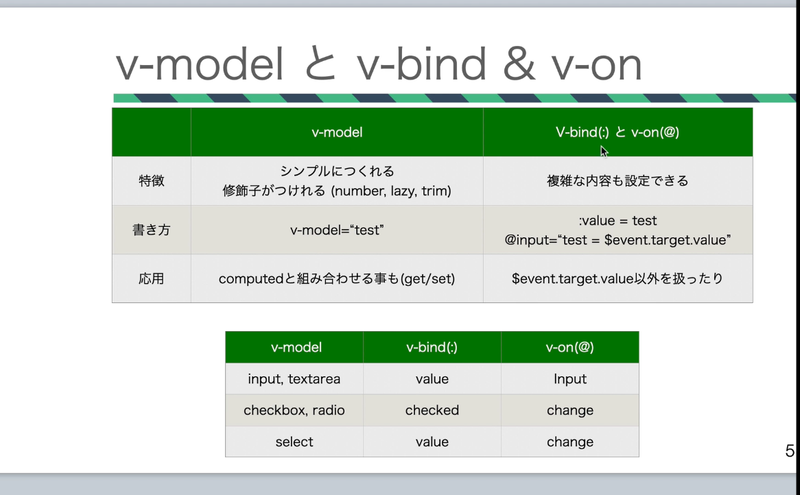
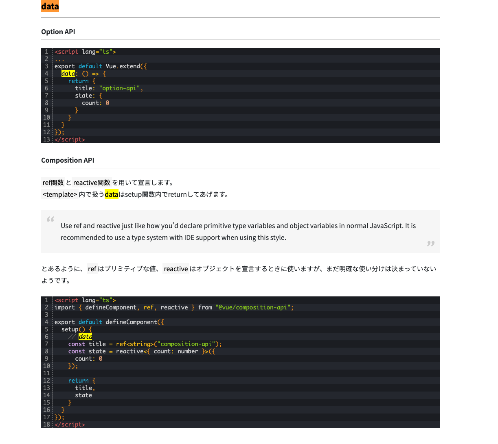

# Vue/Nuxt3

# 双方向データバインディング


# composition API との向き合い方
- [Vue3のCompositionAPIとうまく向き合う方法](https://zenn.dev/yodaka/articles/0ad6de11192dc9)


# 流れ
vue2(options api) -> vue3(options api) -> vue3(composition api) へ書き直していく。
SPA の実装だったので、 SSR にすべく、 Nuxt3 を導入する。

みたいな流れでやっていく

# 既存のコードの説明
これなにやってんの？

``` vue
import Vue from "vue";
import app from "./index.vue";
import common from "~/utils/mixin-common";
import Vuex from "vuex";
import { CampaignStore } from "~/utils/campaign-store";

<!-- mixin を呼び出す -->
common();

<!-- production 用の mode の説明をしない -->
Vue.config.productionTip = false;
<!-- vue 用のライブラリである Vuex ライブラリを使う -->
Vue.use(Vuex);

<!-- vuex  -->
const store = new Vuex.Store({
  modules: {
    CampaignStore
  }
});

<!--  -->
new Vue({
  store,
  render: h => h(app)
}).$mount("#app");
```

# vue ファイルを分ける
- [Vue\.js: マウントのしかた まとめ \- Qiita](https://qiita.com/kazutosato/items/60527d0876ef13ab96cf)

# ディレクティブ
- [ディレクティブ \| Vue\.js](https://v3.ja.vuejs.org/api/directives.html#v-text)
- v-show
- v-if
- v-for
- v-on `@`
- v-bind `:`
- v-model
- v-slot

マスタッシュ構文

# computed と methods の違い

# props と data の違い
props: 親コンポーネントから受け取るデータ
単方向データフロー

data: Vue インスタンスで利用するデータオブジェクト
vue3 ではクラスは使わずに、関数で書くことになるのでインスタンスのプロパティ data は使わないで、 setup 関数の中で利用する variable がそれに対応する



- [過去のコードをComposition APIを使って書き直してみる（前編） : ビジネスとIT活用に役立つ情報（株式会社アーティス）](https://www.asobou.co.jp/blog/web/composition-api1)
- [プロパティ — Vue\.js](https://jp.vuejs.org/v2/guide/components-props.html)
- [Nuxt\.js使ってみた Part5~小ネタ:propsとdataの違い編~ \- Aikの技術日記](https://aik0aaat.hatenadiary.jp/entry/2020/07/05/213041)

# vue3 で新たに追加された provide/inject
- props/emit
- provide/inject

- [【Vue3】Vue\.jsのデータフローおさらい！ ｜エンジニアBLOG｜株式会社クラウドスミス](https://cloudsmith.co.jp/blog/frontend/2020/12/1656030.html)

# memo
vue-property-decorator or vue.extend
- [\[Vue\+TypeScript\] Vue\.extend で Vue らしさを保ちつつ TypeScript で書くときの型宣言についてまとめた \- Qiita](https://qiita.com/is_ryo/items/6fc799ba4214db61d8ab)


# class component vs vue-property-decorator (ts) vs vue extend (ts) vs script setup
- [vue\-property\-decorator \+ TypeScriptで書かれたVueコンポーネントをscript setupで書き換える](https://zenn.dev/r57ty7/articles/53d189afa27aeb)
- [TypeScriptでVueコンポーネントを開発する方法 \| NHN Cloud Meetup](https://meetup-jp.toast.com/1843)

cushion は、 vue.extend を使ってる

# SFC (Single File Component)
hgoe.vue 形式の以下のようなファイル(template, logic, style を一つにまとめるやりかた)。いわゆるコンポーネント思考なファイル構造
この形式で書くと、 build tool が必要


``` vue
<template>
  <p class="greeting">{{ greeting }}</p>
</template>

<script>
export default {
  data() {
    return {
      greeting: 'Hello World!'
    }
  }
}
</script>

<style>
.greeting {
  color: red;
  font-weight: bold;
}
</style>
```

- [単一ファイルコンポーネント \| Vue\.js](https://v3.ja.vuejs.org/guide/single-file-component.html#%E5%89%8D%E6%9B%B8%E3%81%8D)
- [SFC 構文の仕様 \| Vue\.js](https://v3.ja.vuejs.org/api/sfc-spec.html)

# vue2 -> vue3 の違い
- [【Vue 3】Composition API の基本](https://b1san-blog.com/post/vue/vue-3-composition-api/)
- [Composition API \| Vue\.js](https://v3.ja.vuejs.org/api/composition-api.html)
- [Moving from Vue 2's Option API to Vue 3's Composition API \- Terabyte Tiger](https://terabytetiger.com/lessons/moving-from-vue-2-to-vue-3-composition-api)


# 参考
